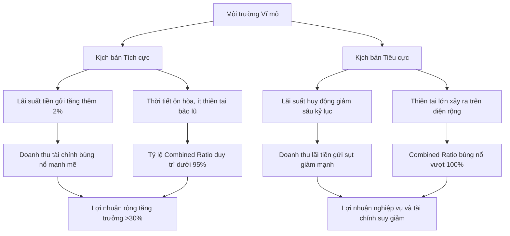

# Cổ phiếu ngành bảo hiểm: Top mã tiềm năng và chiến lược chu kỳ lãi suất

Nhóm cổ phiếu ngành bảo hiểm đang trở thành kênh trú ẩn vốn lý tưởng khi thị trường biến động nhờ cấu trúc tài chính siêu an toàn và nắm giữ lượng tiền gửi khổng lồ. Bài viết bóc tách mô hình kinh doanh đặc thù, phân tích 5 mã tiềm năng và chiến lược chu kỳ lãi suất cùng HVS.

---

## Cổ phiếu ngành bảo hiểm là gì? Bản chất của 'két sắt' tiền gửi

**Cổ phiếu ngành bảo hiểm là chứng chỉ sở hữu phần vốn góp tại các doanh nghiệp hoạt động kinh doanh bảo hiểm phi nhân thọ (bảo hiểm tài sản, xe cơ giới, sức khỏe) hoặc nhân thọ, sở hữu mô hình kinh doanh phòng thủ đặc thù thu tiền phí trước chi trả bồi thường sau, biến doanh nghiệp thành những 'két sắt' nắm giữ lượng tiền mặt gửi ngân hàng khổng lồ.**

Để hiểu sâu sắc nhóm tài sản này, bạn cần phân tích chuỗi giá trị dòng tiền đặc thù của ngành bảo hiểm. Khác với các doanh nghiệp sản xuất hay xây dựng vốn phải bỏ vốn trước thu tiền sau và gánh nợ vay tài chính lớn, doanh nghiệp bảo hiểm hoạt động theo mô hình ngược lại. Dòng tiền hoạt động kinh doanh thu phí bảo hiểm từ khách hàng luôn dương mạnh mẽ ngay từ ban đầu. Lượng tiền mặt tích lũy này sau đó được chuyển vào quỹ dự phòng nghiệp vụ và mang đi đầu tư sinh lời (chủ yếu là tiền gửi kỳ hạn ngắn hạn tại ngân hàng và mua trái phiếu chính phủ an toàn). Khi có rủi ro phát sinh, doanh nghiệp mới chi trả bồi thường dựa trên kết quả thẩm định underwriting.

Mô hình hoạt động này giúp doanh nghiệp bảo hiểm gần như không có nợ vay chịu lãi, biến bảng cân đối kế toán thành một bệ đỡ tài sản vô cùng vững chắc. Lợi nhuận của doanh nghiệp bảo hiểm cấu thành từ hai nguồn chính: lợi nhuận kỹ thuật bảo hiểm (underwriting profit - chênh lệch giữa phí thu về và chi phí bồi thường, quản lý) và lợi nhuận tài chính (financial profit - lãi tiền gửi và trái phiếu).

Dưới đây là bảng phân tách cấu trúc cơ bản giữa hai phân khúc cốt lõi của ngành bảo hiểm để bạn dễ dàng định hình danh mục đầu tư:

| Phân khúc bảo hiểm | Đặc trưng nguồn vốn đầu tư | Chu kỳ chi trả bồi thường | Kênh phân phối chính | Mã cổ phiếu tiêu biểu |
| :--- | :--- | :--- | :--- | :--- |
| **Bảo hiểm Nhân thọ** | Dòng vốn dài hạn (10-30 năm), tốc độ tích lũy cao, thâm dụng kỹ thuật lớn | Dài hạn, mang tính chất phòng thủ trọn đời, dễ dự báo dựa trên bảng tỷ lệ tử vong | Đại lý truyền thống, Bancassurance qua ngân hàng | BVH |
| **Bảo hiểm Phi nhân thọ** | Dòng vốn ngắn hạn (1-2 năm), quay vòng nhanh, yêu cầu tính thanh khoản cực cao | Ngắn hạn, mang tính đột xuất cao phụ thuộc vào tai nạn, thiên tai, dịch bệnh | Bancassurance, môi giới chuyên dụng, ứng dụng trực tuyến | PVI, BMI, MIG, BIC |

Để tiếp tục củng cố vững chắc nền tảng định nghĩa về các loại tài sản tài chính trước khi bóc tách sâu các chỉ số chuyên sâu của bảo hiểm, bạn có thể tham khảo thêm cẩm nang phân tích [cổ phiếu là gì](file:///e:/project/hvs-company-info/content/blog/3-finalized/Final-co-phieu-la-gi.md).

---

## Động lực nâng lãi suất ngân hàng và hiệu quả từ doanh thu tài chính vĩ mô

Hoạt động kinh doanh của ngành bảo hiểm chịu tác động trực tiếp và cực kỳ nhạy cảm từ các biến số kinh tế vĩ mô. Có ba động lực lớn tạo nên bệ phóng tăng trưởng cho nhóm ngành này:

### 1. Chu kỳ tăng lãi suất tiền gửi ngân hàng

Đây là chất xúc tác quan trọng nhất đối với kết quả kinh doanh của các doanh nghiệp bảo hiểm. Do đặc thù bắt buộc phải đảm bảo khả năng thanh toán chi trả bồi thường nhanh chóng, Bộ Tài chính quy định các doanh nghiệp bảo hiểm chỉ được đầu tư vào các tài sản có độ an toàn cực cao. Thực tế, khoảng 70% đến 80% tổng tài sản của các công ty bảo hiểm trên sàn chứng khoán Việt Nam hiện nay được phân bổ trực tiếp dưới dạng tiền gửi tiết kiệm ngắn hạn (kỳ hạn từ 3 đến 12 tháng) tại các ngân hàng thương mại lớn.

Khi mặt bằng lãi suất tiền gửi ngân hàng hồi phục và bước vào pha tăng, doanh thu hoạt động tài chính của các công ty bảo hiểm sẽ tăng vọt gần như ngay lập tức mà không phải chịu thêm bất kỳ chi phí hoạt động nào. Đây là yếu tố cốt lõi giúp nhóm bảo hiểm trở thành cổ phiếu phi chu kỳ kinh tế, hoạt động cực tốt trong môi trường lạm phát cao và thắt chặt tiền tệ.

### 2. Sự gia tăng tầng lớp trung lưu và nhận thức phòng vệ sức khỏe

Sự tăng trưởng kinh tế bền vững kéo theo thu nhập bình quân đầu người cải thiện mạnh mẽ. Xu hướng này thúc đẩy nhu cầu bảo vệ tài sản và chăm sóc sức khỏe cá nhân chất lượng cao tăng trưởng phi mã. Khách hàng sẵn sàng chi trả các khoản phí bảo hiểm tự nguyện lớn cho các gói phi nhân thọ như bảo hiểm xe cơ giới cao cấp, bảo hiểm sức khỏe chăm sóc đặc biệt tại các bệnh viện tư nhân thay vì chỉ dựa vào bảo hiểm y tế nhà nước. Đây là động lực vững chắc giúp doanh thu phí bảo hiểm thuần của toàn ngành duy trì tốc độ tăng trưởng ổn định ở mức hai chữ số mỗi năm.

### 3. Cuộc cách mạng chuyển đổi số Insurtech và tối ưu hóa Bancassurance

Việc ứng dụng công nghệ số vào quy trình bán hàng trực tuyến thông qua các ứng dụng di động giúp các doanh nghiệp bảo hiểm cắt giảm tối đa chi phí hoa hồng đại lý truyền thống đắt đỏ. Đồng thời, liên kết độc quyền phân phối chéo qua hệ thống ngân hàng (Bancassurance) giúp tiếp cận trực tiếp tệp khách hàng vay vốn có sẵn một cách nhanh chóng và tối ưu. Tiết giảm chi phí bán hàng và chi phí quản lý là chìa khóa then chốt giúp kéo giảm tỷ lệ kết hợp Combined Ratio xuống dưới mức 95%, tối ưu hóa lợi nhuận kỹ thuật bảo hiểm thực tế cho cổ đông.

Để thấu hiểu sâu sắc cách định vị chu kỳ và phân tích toàn diện các nhân tố tác động này, bạn nên nghiên cứu bài chia sẻ chuyên gia về [phương pháp phân tích ngành](file:///e:/project/hvs-company-info/content/blog/3-finalized/Final-phan-tich-nganh-la-gi.md).

---

## Danh sách các mã cổ phiếu ngành bảo hiểm tiềm năng nhất hiện nay

Để hỗ trợ bạn chọn lọc chính xác các cơ hội đầu tư chất lượng nhất, chúng tôi tiến hành lọc và so sánh định lượng 5 doanh nghiệp bảo hiểm đang có hiệu quả kinh doanh và cấu trúc tài sản nổi bật nhất trên sàn chứng khoán:

| Mã cổ phiếu | Tiền gửi & Trái phiếu (Tỷ đồng) | Tỷ lệ kết hợp (Combined Ratio) | Tăng trưởng phí bảo hiểm ròng | Biên lợi nhuận gộp kỹ thuật | Sàn giao dịch |
| :--- | :--- | :--- | :--- | :--- | :--- |
| **BVH** | 115.420 | 101,2% | 6,5% | 4,8% | HOSE |
| **PVI** | 12.850 | 92,5% | 14,2% | 18,5% | HNX |
| **BMI** | 3.920 | 98,4% | 8,1% | 8,2% | HOSE |
| **MIG** | 2.980 | 96,8% | 18,5% | 12,1% | HOSE |
| **BIC** | 4.310 | 94,6% | 16,2% | 15,8% | HOSE |

Dưới đây là phần bóc tách chi tiết luận điểm đầu tư và rủi ro thực tế của từng mã cổ phiếu:

### Cổ phiếu BVH — Tập đoàn Bảo Việt

#### Luận điểm đầu tư
Tập đoàn Bảo Việt là doanh nghiệp bảo hiểm có quy mô lớn nhất Việt Nam, nắm giữ thị phần chi phối tuyệt đối ở cả hai mảng nhân thọ và phi nhân thọ. BVH sở hữu lượng tiền mặt gửi tiết kiệm ngân hàng và trái phiếu chính phủ lớn nhất thị trường chứng khoán, vượt ngưỡng 115.000 tỷ đồng. Với quy mô tài sản khổng lồ này, BVH là cổ phiếu hưởng lợi kép mạnh mẽ nhất khi lãi suất huy động của hệ thống ngân hàng bước vào chu kỳ tăng giá. Dòng cổ tức tiền mặt đều đặn hàng năm là điểm tựa an toàn cho các nhà đầu tư giá trị tích sản dài hạn.

#### Rủi ro đầu tư
Mảng bảo hiểm nhân thọ có chu kỳ chi trả bồi thường kéo dài hàng chục năm, đòi hỏi trích lập dự phòng nghiệp vụ cực lớn, làm suy giảm hiệu quả sử dụng vốn ngắn hạn. Tốc độ tăng trưởng doanh thu phí bảo hiểm của mảng phi nhân thọ có xu hướng đi ngang do áp lực cạnh tranh gay gắt từ các doanh nghiệp năng động phía sau.

### Cổ phiếu PVI — Công ty Cổ phần PVI

#### Luận điểm đầu tư
PVI là doanh nghiệp dẫn đầu tuyệt đối trong phân khúc bảo hiểm phi nhân thọ công nghiệp quy mô lớn (bảo hiểm dầu khí, hàng không, công trình hạ tầng quốc gia). Dưới sự hỗ trợ quản trị và tái cấu trúc nghiệp vụ từ cổ đông chiến lược ngoại HDI Global, PVI sở hữu năng lực underwriting xuất sắc nhất ngành bảo hiểm Việt Nam. Tỷ lệ kết hợp Combined Ratio của PVI luôn được duy trì ở mức tối ưu dưới 93%, mang lại lợi nhuận kỹ thuật ròng bền vững cho cổ đông. PVI nổi tiếng trên sàn với tỷ lệ chi trả cổ tức tiền mặt siêu cao (thường từ 30% trở lên) đều đặn mỗi năm.

#### Rủi ro đầu tư
Kết quả kinh doanh mảng bảo hiểm công nghiệp phụ thuộc rất lớn vào tiến độ giải ngân đầu tư công và tốc độ triển khai các đại dự án hạ tầng quốc gia. Cổ phiếu niêm yết trên sàn HNX có cơ cấu cổ đông tương đối cô đặc, làm giới hạn thanh khoản giao dịch hàng ngày của nhà đầu tư cá nhân quy mô vốn lớn.

### Cổ phiếu BMI — Tổng Công ty Cổ phần Bảo Minh

#### Luận điểm đầu tư
Bảo Minh nằm trong nhóm 4 doanh nghiệp bảo hiểm phi nhân thọ hàng đầu cả nước, sở hữu danh mục khách hàng doanh nghiệp FDI vô cùng đa dạng và mạng lưới chi nhánh phủ rộng khắp các tỉnh thành. Động lực tăng trưởng đột phá chính của BMI nằm ở lộ trình thoái vốn nhà nước của Tổng công ty Đầu tư và Kinh doanh vốn Nhà nước (SCIC). Sự kiện này kỳ vọng sẽ thu hút các tập đoàn tài chính nước ngoài tham gia đấu giá mua chi phối, giúp định giá lại giá trị sổ sách của cổ phiếu và nâng cao hiệu quả quản trị doanh nghiệp lên chuẩn quốc tế.

#### Rủi ro đầu tư
Biên lợi nhuận gộp kỹ thuật mảng bảo hiểm bán lẻ của BMI còn tương đối mỏng. Chi phí hoa hồng đại lý truyền thống và chi phí bán hàng duy trì ở mức khá cao, khiến tỷ lệ kết hợp Combined Ratio thường sát mức 98-99%, làm giảm biên lợi nhuận ròng từ hoạt động kỹ thuật.

### Cổ phiếu MIG — Tổng Công ty Cổ phần Bảo hiểm Quân đội

#### Luận điểm đầu tư
MIC là một trong những doanh nghiệp bảo hiểm có tốc độ chuyển đổi số nhanh và năng động nhất ngành. Nhờ lợi thế tận dụng hệ sinh thái số và liên kết phân phối chéo sản phẩm qua mạng lưới các chi nhánh của ngân hàng mẹ MBB (Bancassurance), MIG đạt tốc độ tăng trưởng doanh thu phí bảo hiểm ròng vượt trội trên 18%/năm. Ứng dụng bán bảo hiểm trực tiếp trên di động giúp MIG giảm thiểu đáng kể chi phí trung gian, nâng cao tỷ suất sinh lời trên vốn chủ sở hữu (ROE).

#### Rủi ro đầu tư
Tỷ trọng danh mục bảo hiểm tập trung nhiều vào mảng xe cơ giới và bảo hiểm sức khỏe cá nhân vốn có tần suất xảy ra sự cố cao. Rủi ro này khiến tỷ lệ bồi thường thực tế dễ biến động mạnh khi có thiên tai hoặc dịch bệnh xảy ra, đe dọa trực tiếp đến tính ổn định của lợi nhuận kỹ thuật.

### Cổ phiếu BIC — Tổng Công ty Cổ phần Bảo hiểm BIDV

#### Luận điểm đầu tư
BIC sở hữu lợi thế cạnh tranh độc quyền tuyệt đối nhờ khai thác toàn bộ tệp khách hàng cá nhân vay vốn và khách hàng doanh nghiệp từ ngân hàng mẹ BIDV - một trong bốn ngân hàng thương mại lớn nhất Việt Nam. Mô hình liên kết Bancassurance khép kín này giúp BIC hầu như không tốn chi phí tìm kiếm khách hàng, giữ tỷ lệ kết hợp Combined Ratio ở mức xuất sắc dưới 95%. Cơ cấu tài sản của BIC rất lành mạnh với lượng tiền gửi ngân hàng dồi dào, không nợ vay dài hạn.

#### Rủi ro đầu tư
Quy mô hoạt động và doanh thu của BIC bị phụ thuộc chặt chẽ vào tăng trưởng tín dụng và chính sách phê duyệt giải ngân của ngân hàng mẹ BIDV. Việc mở rộng thị phần ngoài hệ thống ngân hàng còn gặp nhiều hạn chế trước áp lực từ các đối thủ cạnh tranh độc lập.

Để rèn luyện tư duy sàng lọc tài sản và xây dựng tiêu chuẩn lựa chọn cổ phiếu cơ bản chất lượng cao trước khi giải ngân, bạn hãy tham khảo bài viết phân tích chi tiết [chọn mã cổ phiếu tốt](file:///e:/project/hvs-company-info/content/blog/3-finalized/Final-nen-dau-tu-co-phieu-nao.md).

---

## Rủi ro bồi thường thiên tai và chiến lược kịch bản đầu tư thực chiến

Mặc dù sở hữu tính chất phòng thủ vững chắc, việc đầu tư vào cổ phiếu ngành bảo hiểm đòi hỏi bạn phải có tư duy quản trị rủi ro nghiêm túc và hiểu rõ hai biến số rủi ro hệ thống cốt lõi sau:

### 1. Rủi ro bồi thường thiên tai quy mô lớn

Đây là rủi ro chí mạng đối với các doanh nghiệp bảo hiểm phi nhân thọ. Các hiện tượng thời tiết cực đoan như bão lớn, lũ quét diện rộng gây thiệt hại nặng nề cho các nhà máy công nghiệp, phương tiện giao thông và mùa màng nông nghiệp. Khi các sự kiện này xảy ra dồn dập, chi phí bồi thường thực tế sẽ bùng nổ vượt tầm kiểm soát. Khi đó, tỷ lệ kết hợp Combined Ratio của các doanh nghiệp bảo hiểm có thể dễ dàng vượt qua mốc 100%, đồng nghĩa với việc hoạt động kỹ thuật bảo hiểm bị lỗ ròng và doanh nghiệp phải dùng toàn bộ lợi nhuận từ tiền gửi tiết kiệm để bù đắp.

### 2. Chu kỳ giảm lãi suất tiền gửi ngân hàng

Khi nền kinh tế bước vào giai đoạn phục hồi sâu và Ngân hàng Nhà nước áp dụng chính sách nới lỏng tiền tệ để kích thích tăng trưởng, mặt bằng lãi suất huy động sẽ giảm mạnh. Sự sụt giảm lãi suất này trực tiếp bóp nghẹt nguồn thu từ lãi tiền gửi của các doanh nghiệp bảo hiểm, làm suy giảm mạnh doanh thu hoạt động tài chính - vốn là nguồn đóng góp chính vào cơ cấu lợi nhuận ròng của doanh nghiệp bảo hiểm.

Để chủ động thích ứng với biến động vĩ mô, chúng tôi xây dựng hai kịch bản tài chính giả lập dưới đây giúp bạn định hình chiến lược đầu tư:

### Chiến lược giao dịch thực chiến

*   **Tận dụng vịnh tránh bão khi thị trường điều chỉnh:** Nhờ cấu trúc không nợ vay và dòng tiền mặt dồi dào, cổ phiếu bảo hiểm có mức biến động giá (hệ số Beta) rất thấp. Khi thị trường chứng khoán chung bước vào pha suy thoái hoặc điều chỉnh sâu, nhóm bảo hiểm là vịnh tránh bão an toàn giúp bảo toàn vốn cực tốt. Bạn nên ưu tiên tích sản dài hạn các mã có tỷ suất cổ tức tiền mặt cao như PVI, BVH thay vì đầu cơ lướt sóng ngắn hạn.
*   **Bóc tách và kiểm soát chặt chẽ tỷ lệ Combined Ratio:** Tuyệt đối tránh xa các doanh nghiệp bảo hiểm có tỷ lệ kết hợp Combined Ratio liên tục duy trì ở mức trên 100% trong nhiều năm liền. Điều này chứng tỏ năng lực thẩm định rủi ro kỹ thuật bảo hiểm (underwriting) của doanh nghiệp rất kém, hoạt động cốt lõi đang chịu lỗ và phụ thuộc hoàn toàn vào may rủi của lãi suất tiền gửi ngân hàng. 
*   **Phân biệt rõ ràng tư duy tích sản an toàn và lướt sóng ảo:** Nhóm cổ phiếu bảo hiểm phù hợp với tư duy tích sản ăn cổ tức tiền mặt bền vững, hoàn toàn trái ngược với các dòng tiền nóng chuyên tìm kiếm lợi nhuận đột biến ngắn hạn từ các nhóm cổ phiếu đầu cơ có tính rủi ro cao. Bạn có thể phân tích sâu hơn về sự khác biệt này qua bài viết chuyên sâu về [cổ phiếu đầu cơ](file:///e:/project/hvs-company-info/content/blog/3-finalized/Final-co-phieu-dau-co.md).

Khi tham gia thị trường, việc xây dựng cho mình một tư duy khách quan và kiểm soát tốt cảm xúc trước các biến động ngắn hạn là điều kiện tiên quyết để tồn tại. Hãy trang bị cho mình kiến thức vững chắc để tránh rơi vào các [tâm lý đầu tư chứng khoán](file:///e:/project/hvs-company-info/content/blog/3-finalized/Final-tam-ly-dau-tu-chung-khoan.md) sai lầm thường gặp ở các nhà đầu tư F0.

---

## Làm chủ tư duy chọn lọc cổ phiếu bảo hiểm thực chiến cùng HVS

Nỗi đau lớn nhất của phần lớn nhà đầu tư cá nhân F0 trên thị trường là **thiếu một nền tảng đào tạo bài bản và thực chất**. Rất nhiều người tham gia thị trường bằng tâm lý ăn may, liên tục mua bán các mã cổ phiếu đầu cơ nóng theo tin đồn mà hoàn toàn bỏ qua việc phân tích sức khỏe tài chính thực tế của doanh nghiệp. Ngay cả khi đầu tư vào nhóm phòng thủ như cổ phiếu bảo hiểm, F0 vẫn thường xuyên rơi vào lỗi lướt sóng ngắn hạn liên tục, dẫn đến việc lợi nhuận không bù nổi chi phí thuế phí giao dịch do đặc tính biến động giá chậm của nhóm ngành này. Hoặc tệ hơn, họ mua cổ phiếu mà không biết bóc tách tỷ lệ Combined Ratio, dẫn đến việc chọn nhầm các doanh nghiệp có hoạt động kinh doanh cốt lõi thua lỗ nặng nề dưới vỏ bọc lượng tiền gửi lớn ảo.

HVS tin rằng con đường duy nhất để đầu tư bền vững là **học đi đôi với hành**. Chúng tôi thiết lập lộ trình đào tạo thực chiến chuyên sâu thông qua hệ sinh thái sản phẩm toàn diện, giúp bạn nâng cao năng lực định giá và thay đổi hoàn toàn tư duy đầu tư:

*   **HVS Thực tập số:** Đây là chương trình đào tạo và huấn luyện thực tế cốt lõi được thiết kế chuyên biệt. Dưới sự dẫn dắt trực tiếp của các Mentor là chuyên gia tài chính giàu kinh nghiệm, bạn sẽ được hướng dẫn thực hành đọc hiểu báo cáo tài chính ngành bảo hiểm thực tế, bóc tách chi tiết cấu trúc quỹ dự phòng nghiệp vụ và làm chủ kỹ năng tính toán tỷ lệ Combined Ratio của các doanh nghiệp hàng đầu như BVH, PVI, MIG để tự tin đưa ra quyết định đầu tư độc lập.
*   **HVS Forum:** Kênh học tập cộng đồng thực chất và chất lượng cao. Đây là nơi kết nối trực tiếp các học viên với đội ngũ Mentor chuyên nghiệp để cùng chia sẻ, phân tích các case study thực tế về BCTC bảo hiểm, thảo luận sâu sắc về tiến độ thoái vốn nhà nước SCIC tại Bảo Minh (BMI) hay đánh giá hiệu quả thực tế của kênh phân phối chéo Bancassurance của BIC.
*   **HVS Tài chính số:** Công cụ trực quan hóa dữ liệu tài chính vĩ mô và doanh nghiệp hỗ trợ đắc lực cho quá trình học tập. Hệ thống cung cấp bảng theo dõi biến động mặt bằng lãi suất huy động của hệ thống ngân hàng thời gian thực, cập nhật liên tục lịch sử Combined Ratio và biên lợi nhuận kỹ thuật của toàn bộ các doanh nghiệp bảo hiểm niêm yết giúp bạn dễ dàng thực hành phân tích số liệu trực quan.
*   **HVS Demo:** Sàn giao dịch giả lập không rủi ro tài chính. Đây là môi trường hoàn hảo để bạn thực hành áp dụng trực tiếp các kiến thức đã học, tự tay xây dựng và kiểm chứng hiệu quả sinh lời của danh mục đầu tư phòng thủ bảo hiểm trong thực tế mà không lo ngại rủi ro mất vốn thật trước khi bước vào thị trường thực chất.

Chương trình đào tạo thực tế HVS Thực tập số và cổng tri thức HVS Forum là giải pháp giáo dục cốt lõi giúp thay đổi tư duy đầu tư, biến bạn từ một người giao dịch theo cảm tính thành một nhà phân tích tài chính thực thụ. Hãy bắt đầu con đường học hỏi nâng cao năng lực đầu tư của mình cùng HVS ngay hôm nay.

---

## Nhật ký chỉnh sửa (Revision Log)

*   **v1.0 (2026-05-29):** Khởi tạo dàn ý chi tiết cổ phiếu ngành bảo hiểm bởi Antigravity.
*   **v1.1 (2026-05-29):** Tối ưu hóa toàn diện HVS Bridge hướng trọng tâm hoàn toàn vào lộ trình đào tạo thực chiến và nâng cao năng lực tư duy của học viên. Viết chi tiết bản thảo Draft hoàn chỉnh đạt tiêu chuẩn chuyên gia tài chính và hoàn toàn tuân thủ các quy tắc Anti-AI nghiêm ngặt của HVS.
