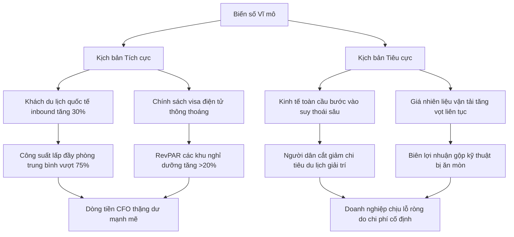

# Cổ phiếu ngành du lịch: Top mã tiềm năng và chiến lược chu kỳ

Đầu tư cổ phiếu ngành du lịch đang đứng trước cơ hội bứt phá nhờ sự trở lại của dòng khách quốc tế. Bài viết bóc tách sâu chuỗi giá trị ngành, cung cấp danh mục mã tiềm năng và chiến lược quản trị rủi ro chu kỳ cùng HVS.

---

## Cổ phiếu ngành du lịch là gì? Bản chất nhóm thầu dịch vụ không khói

**Cổ phiếu ngành du lịch là chứng chỉ sở hữu phần vốn góp tại các doanh nghiệp hoạt động kinh doanh lữ hành, dịch vụ lưu trú khách sạn, resort nghỉ dưỡng hoặc vận tải du lịch biển, sở hữu chu kỳ hoạt động phụ thuộc cực lớn vào sức mua xã hội và lưu lượng khách quốc tế.**

Chuỗi giá trị của ngành du lịch cấu thành từ nhiều mắt xích quan trọng, liên kết chặt chẽ với nhau để phục vụ nhu cầu trải nghiệm của khách hàng. Khi phân tích nhóm ngành này, bạn cần hiểu rõ dòng tiền dịch chuyển qua từng phân khúc kinh doanh cốt lõi. Lữ hành là đơn vị đầu tiên tiếp cận và gom khách, tổ chức tour tuyến. Vận tải du lịch (hàng không, đường biển, đường bộ) chịu trách nhiệm luân chuyển hành khách. Cuối cùng, dịch vụ lưu trú khách sạn và resort nghỉ dưỡng là nơi thu hút dòng tiền tiêu dùng trực tiếp lớn nhất thông qua các dịch vụ lưu trú, ẩm thực và giải trí.

Mô hình hoạt động của các doanh nghiệp du lịch sở hữu đặc thù chi phí cố định cực lớn (chi phí khấu hao tài sản cố định như resort, tàu cao tốc, chi phí nhân sự vận hành hệ thống). Khi công suất sử dụng phòng khách sạn hay hiệu suất khai thác chuyến tàu vượt qua điểm hòa vốn, biên lợi nhuận gộp của doanh nghiệp sẽ mở rộng rất nhanh nhờ hiệu ứng đòn bẩy hoạt động. Ngược lại, vào mùa thấp điểm hoặc chu kỳ kinh tế suy thoái, chi phí vận hành cố định đè nặng sẽ nhanh chóng ăn mòn toàn bộ doanh thu, khiến doanh nghiệp rơi vào tình trạng thua lỗ nặng nề.

Dưới đây là bảng phân tách cấu trúc cơ bản giữa các phân khúc chính của ngành du lịch để bạn dễ dàng phân loại tài sản khi thiết lập danh mục đầu tư:

| Phân khúc ngành | Đặc trưng biên lợi nhuận gộp | Cấu trúc tài sản chủ yếu | Động lực tăng trưởng chính | Mã cổ phiếu tiêu biểu |
| :--- | :--- | :--- | :--- | :--- |
| **Dịch vụ lưu trú** | Dao động cực lớn (15% - 50%) tùy thuộc vào tỷ lệ lấp đầy phòng trung bình | Tài sản cố định chiếm tỷ trọng lớn (resort, tòa nhà khách sạn lớn) | Lưu lượng khách thượng lưu, chỉ số RevPAR tăng trưởng | NVT, DAH |
| **Vận tải du lịch** | Nhạy cảm cao với chi phí nhiên liệu đầu vào (xăng, dầu DO) | Đội tàu cao tốc, máy bay, phương tiện chuyên dụng giá trị lớn | Hiệu suất khai thác chuyến, giá dầu thế giới bình ổn | SKG |
| **Lữ hành & Tour** | Biên gộp mỏng (5% - 12%), thâm dụng lao động dịch vụ cao | Khoản phải thu ngắn hạn chiếm tỷ trọng lớn trong cơ cấu | Sức chi tiêu cá nhân, sự hồi sinh của thị trường tour quốc tế | VTD |

Trước khi đi sâu vào bóc tách các chỉ số tài chính chuyên sâu của từng doanh nghiệp du lịch cụ thể, bạn nên củng cố lại toàn bộ nền tảng kiến thức cốt lõi tại bài chia sẻ [cổ phiếu là gì](file:///e:/project/hvs-company-info/content/blog/3-finalized/Final-co-phieu-la-gi.md).

---

## Động lực thúc đẩy chu kỳ bứt phá mới của ngành du lịch

Hoạt động kinh doanh của nhóm ngành du lịch đang đứng trước cơ hội mở ra một chu kỳ phục hồi mạnh mẽ nhờ sự đồng thuận của nhiều biến số vĩ mô tích cực dưới đây:

### 1. Sự phục hồi của lượng du khách quốc tế chất lượng cao

Dòng khách du lịch quốc tế (khách inbound) đóng vai trò là nguồn lực tài chính chủ đạo quyết định biên lợi nhuận ròng của các khách sạn và resort cao cấp. Khác với dòng khách nội địa có xu hướng thắt chặt chi tiêu và chỉ tập trung vào các mùa lễ tết ngắn ngày, khách quốc tế thường có thời gian lưu trú kéo dài từ 7 đến 15 ngày với mức chi tiêu bình quân cho các dịch vụ phụ trợ cao gấp 3-4 lần. Sự hồi sinh mạnh mẽ của dòng khách từ các quốc gia Đông Á, châu Âu và Bắc Mỹ trực tiếp kéo công suất lấp đầy phòng của các điểm nghỉ dưỡng lớn bứt phá qua điểm hòa vốn, tạo nên cú hích doanh thu tài chính cực lớn cho doanh nghiệp. Mục tiêu đón 18 triệu lượt khách quốc tế của Việt Nam chính là cột mốc kích hoạt điểm bùng nổ lợi nhuận cho các doanh nghiệp sở hữu hạ tầng lưu trú sẵn có trên sàn.

### 2. Các chính sách nới lỏng visa và kích cầu vĩ mô từ cơ quan quản lý

Tổng cục Du lịch Việt Nam phối hợp chặt chẽ với các cơ quan ngoại giao liên tục đẩy mạnh cải cách thủ tục hành chính, nới lỏng thời hạn thị thực visa điện tử (e-visa) lên đến 90 ngày và mở rộng danh sách các quốc gia được miễn thị thực đơn phương từ 15 ngày lên 45 ngày. Chính sách thông thoáng này giúp Việt Nam trở thành điểm đến cực kỳ cạnh tranh trong khu vực Đông Nam Á, thu hút mạnh mẽ các đoàn khách MICE (du lịch kết hợp hội nghị) quy mô lớn và dòng khách nghỉ dưỡng dài ngày có thu nhập cao. Dòng khách lưu trú dài ngày này giúp các doanh nghiệp lữ hành và khách sạn giải quyết triệt để bài toán công suất phòng trống trong những ngày giữa tuần - vốn là điểm yếu cố hữu của du lịch nội địa.

### 3. Xu hướng chuyển dịch hành vi tiêu dùng trải nghiệm của thế hệ trẻ

Hành vi tiêu dùng của tệp khách hàng trẻ tuổi (Millennials và Gen Z) đã dịch chuyển rõ rệt từ tích lũy tài sản vật chất sang chi tiêu cho các hoạt động trải nghiệm thực tế. Họ sẵn sàng chi trả mức giá phòng cao tại các resort thân thiện môi trường hoặc các tour khám phá độc bản để đổi lấy trải nghiệm sống độc đáo. Sự dịch chuyển hành vi này giúp các doanh nghiệp du lịch tăng trưởng mạnh chỉ số RevPAR (Doanh thu trên mỗi phòng có sẵn) mà không phụ thuộc vào chiến dịch giảm giá cạnh tranh khốc liệt. Khi chỉ số RevPAR tăng trưởng đồng pha với công suất phòng sử dụng thực tế, biên gộp kỹ thuật của mảng lưu trú sẽ ghi nhận mức cải thiện vượt trội từ 5% đến 8% chỉ trong một chu kỳ báo cáo ngắn hạn.

Để chủ động nhận diện thời điểm vàng khi dòng tiền thông minh bắt đầu xoay trục sang nhóm ngành dịch vụ này, bạn hãy tìm hiểu sâu sắc bài hướng dẫn [phương pháp phân tích ngành](file:///e:/project/hvs-company-info/content/blog/3-finalized/Final-phan-tich-nganh-la-gi.md).

---

## Danh sách các mã cổ phiếu ngành du lịch tiềm năng nhất hiện nay

Để giúp bạn chọn lọc chính xác các cơ hội đầu tư thực chất, tránh xa các bẫy thanh khoản ảo, chúng tôi tiến hành phân tích định lượng và so sánh hiệu quả hoạt động của 4 doanh nghiệp du lịch tiêu biểu đang niêm yết trên sàn:

| Mã cổ phiếu | Tỷ lệ lấp đầy phòng trung bình | Khoản phải thu / Tổng tài sản | Tỷ lệ Nợ / Vốn chủ sở hữu | Biên lợi nhuận gộp kỹ thuật | Sàn giao dịch |
| :--- | :--- | :--- | :--- | :--- | :--- |
| **SKG** | 62% (Hiệu suất tàu) | 3,8% | 8,5% | 22,5% | HOSE |
| **VTD** | N/A (Lữ hành) | 48,5% | 34,2% | 6,8% | HNX |
| **NVT** | 58% (Resort cao cấp) | 5,2% | 18,2% | 45,6% | HOSE |
| **DAH** | 35% (Khách sạn tỉnh) | 26,4% | 55,8% | 14,2% | HOSE |

Dưới đây là phần bóc tách chi tiết luận điểm đầu tư cốt lõi và rủi ro thực tế của từng doanh nghiệp:

### Cổ phiếu SKG — Công ty Cổ phần Tàu cao tốc Superdong Kiên Giang

#### Luận điểm đầu tư
Superdong Kiên Giang là doanh nghiệp vận tải hành khách đường biển có vị thế độc quyền gần như tuyệt đối trên các tuyến du lịch trọng điểm phía Nam bao gồm Phú Quốc, Rạch Giá, Hà Tiên và Nam Du. SKG có cấu trúc tài chính cực kỳ lành mạnh với tỷ lệ nợ vay gần như bằng 0, lượng tiền mặt tích lũy dồi dào đảm bảo khả năng chi trả cổ tức tiền mặt đều đặn cho cổ đông. Khi du lịch đảo Phú Quốc phục hồi mạnh mẽ, lượng khách di chuyển bằng đường biển tăng cao giúp tối ưu hóa công suất vận hành đội tàu cao tốc hiện đại của SKG, tạo ra dòng tiền hoạt động kinh doanh thặng dư lớn. Đội tàu gồm 16 tàu cao tốc và phà tự hành của SKG luôn sẵn sàng phục vụ lượng khách inbound vượt đỉnh mà không cần thâm dụng vốn vay tài chính để mở rộng quy mô.

#### Rủi ro đầu tư
Biên lợi nhuận gộp của SKG nhạy cảm cực cao với biến động giá dầu DO thế giới đầu vào, vốn chiếm tới trên 40% cơ cấu chi phí vận hành trực tiếp của đội tàu. Do SKG không thực hiện các nghiệp vụ phòng ngừa rủi ro (hedging) giá nhiên liệu, mọi biến động tăng của giá dầu DO trên thị trường thế giới sẽ trực tiếp bào mòn biên lợi nhuận gộp kỹ thuật ngay lập tức. Đồng thời, sự cạnh tranh gay gắt về giá vé từ các hãng hàng không nội địa bay trực tiếp đến Phú Quốc có thể chia sẻ lượng khách tiềm năng của doanh nghiệp.

### Cổ phiếu VTD — Công ty Cổ phần Du lịch Vietourist

#### Luận điểm đầu tư
Vietourist là một trong những đơn vị lữ hành nội địa có mô hình hoạt động linh hoạt, thích ứng nhanh với xu hướng thị trường. VTD tập trung khai thác phân khúc khách hàng doanh nghiệp tổ chức hoạt động team building và đoàn lữ hành lớn với chi phí vận hành tối ưu. Việc chủ động mở rộng liên kết tour quốc tế giúp VTD đón đầu lượng khách outbound đi các nước Đông Bắc Á và Đông Nam Á đang gia tăng mạnh mẽ. Nhờ mô hình nhẹ tài sản (asset-light), VTD không phải chịu áp lực chi phí khấu hao hạ tầng lưu trú khổng lồ như các doanh nghiệp khách sạn.

#### Rủi ro đầu tư
Đặc thù ngành lữ hành khiến khoản phải thu ngắn hạn từ các đối tác tour và khách hàng doanh nghiệp chiếm tỷ trọng rất lớn, lên tới trên 48% cơ cấu tổng tài sản của VTD. Các khoản phải thu này thường kéo dài từ 30 đến 90 ngày, đe dọa trực tiếp đến tính thanh khoản dòng tiền hoạt động của doanh nghiệp khi bước vào mùa thấp điểm. Biên lợi nhuận gộp thực tế duy trì ở mức khá mỏng (chỉ quanh 6-7%), đòi hỏi doanh nghiệp phải quản lý chi phí cực kỳ khắt khe để tránh tình trạng doanh thu lớn nhưng lợi nhuận ròng bằng không.

### Cổ phiếu NVT — Công ty Cổ phần Bất động sản Du lịch Ninh Vân Bay

#### Luận điểm đầu tư
Ninh Vân Bay là doanh nghiệp sở hữu độc quyền resort siêu sang Six Senses Ninh Van Bay tại Nha Trang - một trong những khu nghỉ dưỡng đắt đỏ và uy tín hàng đầu châu Á với 62 biệt thự cao cấp biệt lập. Nhờ tập trung phục vụ tệp khách hàng thượng lưu siêu giàu và du khách quốc tế có khả năng chi trả cao (giá phòng bình quân dao động từ 600 USD đến 1.000 USD/đêm), NVT duy trì biên lợi nhuận gộp cốt lõi cực kỳ xuất sắc lên tới trên 45%. Sức chi tiêu dồi dào của tệp khách hàng này giúp NVT giữ vững công suất lấp đầy phòng nghỉ dưỡng cao cấp bất chấp các biến động chu kỳ kinh tế ngắn hạn.

#### Rủi ro đầu tư
Hoạt động kinh doanh của NVT phụ thuộc hoàn toàn vào hiệu quả khai thác của duy nhất một tổ hợp resort cốt lõi Six Senses Ninh Van Bay. Chi phí khấu hao tài sản cố định lớn và nghĩa vụ chi trả phí quản lý thương hiệu hàng năm cho tập đoàn nước ngoài đè nặng lên lợi nhuận trong những chu kỳ xảy ra thiên tai hoặc thời tiết bất lợi tại miền Trung. Việc mở rộng sang các dự án mới tại Mũi Né hay Gia Lâm còn gặp nhiều khó khăn pháp lý và chưa thể đóng góp dòng tiền trong ngắn hạn.

### Cổ phiếu DAH — Công ty Cổ phần Tập đoàn Khách sạn Đông Á

#### Luận điểm đầu tư
Tập đoàn Khách sạn Đông Á sở hữu chuỗi tổ hợp khách sạn lớn và trung tâm hội nghị có vị trí đắc địa tại trung tâm tỉnh Thái Nguyên - thủ phủ công nghiệp FDI miền Bắc, nổi bật là tổ hợp Đông Á Plaza đạt chuẩn 4 sao với quy mô 150 phòng. DAH đang nỗ lực tái cấu trúc toàn bộ danh mục tài sản, hướng tới phát triển mô hình lưu trú xanh gắn liền với hoạt động nghỉ dưỡng sinh thái để đón đầu dòng chuyên gia ngoại quốc làm việc tại các khu công nghiệp.

#### Rủi ro đầu tư
DAH gánh chịu tỷ lệ đòn bẩy tài chính tương đối cao với các khoản nợ vay ngắn hạn tài trợ cho dự án xây dựng lớn, nợ phải trả chiếm hơn 55% nguồn vốn chủ sở hữu. Công suất lấp đầy phòng tại các khách sạn tỉnh biến động thất thường và thường xuyên duy trì dưới 40% do hạn chế về lưu lượng khách du lịch thuần túy tại Thái Nguyên, khiến doanh nghiệp chịu áp lực thanh toán lãi vay đè nặng.

Để nâng cao năng lực bóc tách chất lượng tài sản thực tế của doanh nghiệp, giúp bạn tự tin loại bỏ các mã cổ phiếu yếu kém trước khi đưa ra quyết định giải ngân, hãy tham khảo cẩm nang [chọn mã cổ phiếu tốt](file:///e:/project/hvs-company-info/content/blog/3-finalized/Final-nen-dau-tu-co-phieu-nao.md).

---

## Rủi ro chu kỳ và chiến lược quản trị dòng tiền thực chiến

Bản chất của việc đầu tư vào nhóm cổ phiếu ngành du lịch đòi hỏi bạn phải có tư duy quản trị rủi ro chu kỳ cực kỳ nghiêm túc, hiểu rõ hai biến số hệ thống cốt lõi sau:

### 1. Tính mùa vụ cực đoan của dòng tiền kinh doanh

Doanh thu của các doanh nghiệp du lịch thường tập trung tối đa vào quý 2 và quý 3 hàng năm (mùa du lịch hè nội địa) hoặc các dịp lễ tết lớn. Trong khoảng thời gian ngắn này, dòng tiền đổ về dồi dào giúp cải thiện kết quả kinh doanh đột biến. Tuy nhiên, trong 2 quý còn lại của năm, doanh thu sụt giảm mạnh nhưng doanh nghiệp vẫn phải gánh toàn bộ chi phí vận hành cố định như lương nhân viên, bảo trì cơ sở hạ tầng, khấu hao tài sản.

### 2. Sự nhạy cảm với biến động thu nhập cá nhân toàn cầu

Du lịch là nhu cầu dịch vụ giải trí không thiết yếu. Khi nền kinh tế vĩ mô đối mặt với rủi ro lạm phát hoặc suy thoái kinh tế, người tiêu dùng sẽ ngay lập tức cắt giảm chi phí du lịch đắt đỏ đầu tiên trong ngân sách chi tiêu để ưu tiên bảo toàn dòng tiền sinh hoạt thiết yếu.

Để giúp bạn xây dựng phương án giao dịch chủ động trước các biến số vĩ mô khó lường này, chúng tôi thiết kế hai kịch bản giả lập dưới đây:

### Chiến lược quản trị dòng tiền thực chiến

*   **Bóc tách điểm hòa vốn hoạt động thực tế:** Bạn có thể tính toán điểm hòa vốn công suất phòng để kiểm chứng sức sống doanh nghiệp lưu trú. Ví dụ: Một resort có chi phí cố định là 2 tỷ đồng/tháng và biến phí là 500.000 đồng/phòng. Nếu giá phòng bình quân (ADR) đạt 3.000.000 đồng/đêm, số phòng cần lấp đầy để hòa vốn là: `2 tỷ / (3 triệu - 500k) = 800 phòng-đêm/tháng`. Đối với khu nghỉ dưỡng có quy mô 50 phòng, công suất tối thiểu hòa vốn sẽ là: `800 / (50 * 30) = 53,3%`. Mức công suất vượt ngưỡng 53,3% này sẽ chuyển hóa doanh thu tăng thêm thành lợi nhuận ròng nhờ đòn bẩy hoạt động.
*   **Bóc tách dòng tiền hoạt động kinh doanh thực chất:** Khi nghiên cứu báo cáo tài chính của doanh nghiệp du lịch, bạn hãy tập trung thẩm định chỉ số dòng tiền hoạt động kinh doanh (CFO) thay vì chỉ nhìn vào chỉ số lợi nhuận sau thuế ghi nhận trên sổ sách kế toán. Một doanh nghiệp du lịch có sức khỏe tài chính thực chất phải có CFO liên tục dương mạnh mẽ, chứng tỏ tiền phí dịch vụ thu về bằng tiền mặt thực tế thay vì bị chiếm dụng dưới dạng các khoản phải thu ngắn hạn lớn.
*   **Tránh đầu cơ lướt sóng ngắn hạn theo mùa vụ cao điểm:** F0 thường mắc sai lầm lớn khi mua đuổi cổ phiếu du lịch vào đỉnh điểm mùa hè khi các tin tức truyền thông đưa tin lưu lượng khách đông đúc. Thực tế, giá cổ phiếu thường đã phản ánh toàn bộ kỳ vọng từ trước đó hàng quý. Việc lướt sóng ngắn hạn theo tin tức mùa vụ này chỉ tạo ra các khoản thua lỗ lớn cho bạn về phí thuế giao dịch do đặc tính biến động thất thường của nhóm ngành này. Bạn nên phân tách rõ nét sự khác biệt giữa dòng tiền đầu tư thực chất và dòng tiền nóng qua cẩm nang về [cổ phiếu đầu cơ](file:///e:/project/hvs-company-info/content/blog/3-finalized/Final-co-phieu-dau-co.md).
*   **Kỷ luật quản trị cảm xúc vĩ mô:** Luôn giữ vững sự bình tĩnh khách quan để đưa ra quyết định dựa trên các số liệu định lượng thực tế, tuyệt đối không đặt lệnh giao dịch dựa theo đám đông hỗn loạn xung quanh để tránh rơi vào các cạm bẫy [tâm lý đầu tư chứng khoán](file:///e:/project/hvs-company-info/content/blog/3-finalized/Final-tam-ly-dau-tu-chung-khoan.md) kinh điển.

---

## Nâng cao năng lực chọn lọc cổ phiếu du lịch thực chiến cùng HVS

Nỗi đau lớn nhất của đại đa số nhà đầu tư cá nhân khi tham gia thị trường chứng khoán là **thiếu một nền tảng kiến thức đào tạo bài bản và chuyên sâu**. Hầu hết mọi người đều chọn cách đầu tư theo cảm tính, mua đuổi cổ phiếu ngành du lịch khi nghe tin tức mùa hè cao điểm mà hoàn toàn không biết cách bóc tách sức khỏe tài chính thực tế của doanh nghiệp. Họ không biết cách tính chỉ số RevPAR tối thiểu để khách sạn nghỉ dưỡng đạt điểm hòa vốn, hay bỏ qua việc kiểm tra dòng tiền hoạt động kinh doanh CFO dẫn đến việc mua nhầm những doanh nghiệp rỗng ruột, gánh nợ lớn. Kết quả là F0 liên tục lướt sóng ngắn hạn thua lỗ và gánh chịu chi phí giao dịch bào mòn tài khoản nhanh chóng.

HVS tin rằng chỉ có con đường giáo dục và đào tạo thực chất mới giúp bạn thay đổi tư duy đầu tư vững chắc. Chúng tôi thiết lập lộ trình **học đi đôi với hành** toàn diện thông qua hệ sinh thái giải pháp giáo dục thực chiến:

*   **HVS Thực tập số:** Đây là chương trình đào tạo và huấn luyện thực tế cốt lõi được thiết kế chuyên sâu. Dưới sự kèm cặp và dẫn dắt trực tiếp của các Mentor là những chuyên gia tài chính hàng đầu, bạn sẽ được trực tiếp thực hành phân tích sâu báo cáo tài chính của các doanh nghiệp như SKG, NVT. Bạn sẽ làm chủ kỹ năng đọc hiểu cấu trúc chi phí cố định, học cách bóc tách và tính toán chỉ số RevPAR thực tế để tự tin định giá cổ phiếu du lịch một cách khoa học mà không phụ thuộc vào tin đồn.
*   **HVS Forum:** Cổng kết nối tri thức cộng đồng chất lượng cao. Đây là nơi kết nối trực tiếp học viên với đội ngũ Mentor chuyên nghiệp để cùng thảo luận, chia sẻ các case study phân tích BCTC thực tiễn, cập nhật số liệu công suất phòng thực tế tại các resort hay bàn luận sâu về tác động của giá dầu DO đầu vào đến biên lợi nhuận của Superdong Kiên Giang.
*   **HVS Tài chính số:** Công cụ trực quan hóa dữ liệu hỗ trợ đắc lực cho quá trình học tập. Hệ thống cung cấp bảng theo dõi liên tục lưu lượng khách du lịch quốc tế vĩ mô, biểu đồ cập nhật giá dầu DO thời gian thực giúp học viên dễ dàng thực hành phân tích mối tương quan số liệu thực tế.
*   **HVS Demo:** Sàn giao dịch giả lập không rủi ro tài chính. Đây là môi trường hoàn hảo để bạn thực hành áp dụng những kiến thức đã học vào thực tế, thử nghiệm xây dựng và kiểm chứng hiệu quả sinh lời của danh mục đầu tư du lịch trước khi chính thức tham gia thị trường thực chất với số vốn thật.

Chương trình đào tạo thực tế HVS Thực tập số và cổng tri thức HVS Forum là giải pháp giáo dục cốt lõi giúp thay đổi tư duy đầu tư của bạn từ một người đầu cơ cảm tính thành một nhà phân tích thực thụ. Hãy bắt đầu con đường học hỏi nâng cao năng lực đầu tư của mình cùng HVS ngay hôm nay.

---

## Nhật ký chỉnh sửa (Revision Log)

*   **v1.0 (2026-05-29):** Khởi tạo dàn ý chi tiết cổ phiếu ngành du lịch bởi Antigravity.
*   **v1.1 (2026-05-29):** Tối ưu hóa toàn diện HVS Bridge hướng trọng tâm hoàn toàn vào lộ trình đào tạo thực chiến và nâng cao năng lực tư duy của học viên. Viết chi tiết bản thảo Draft hoàn chỉnh đạt tiêu chuẩn chuyên gia tài chính và hoàn toàn tuân thủ các quy tắc Anti-AI nghiêm ngặt của HVS.
