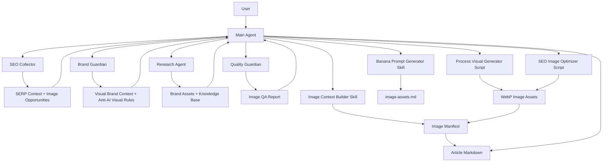
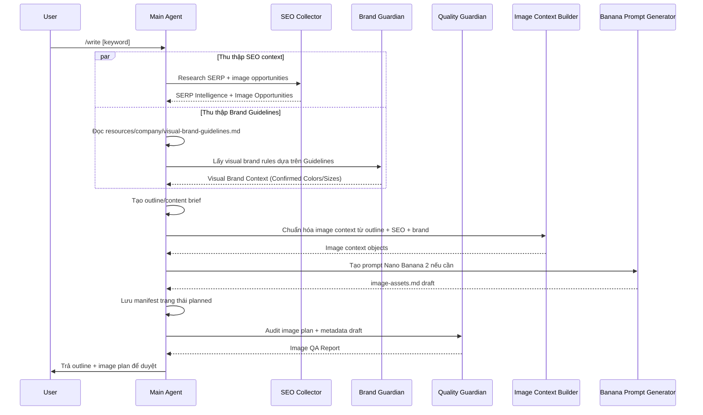
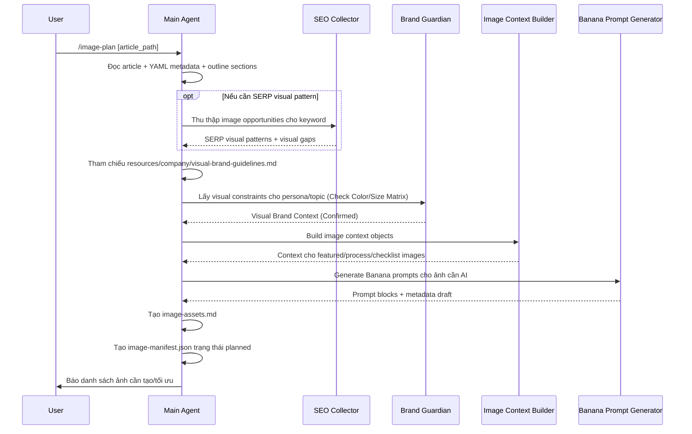
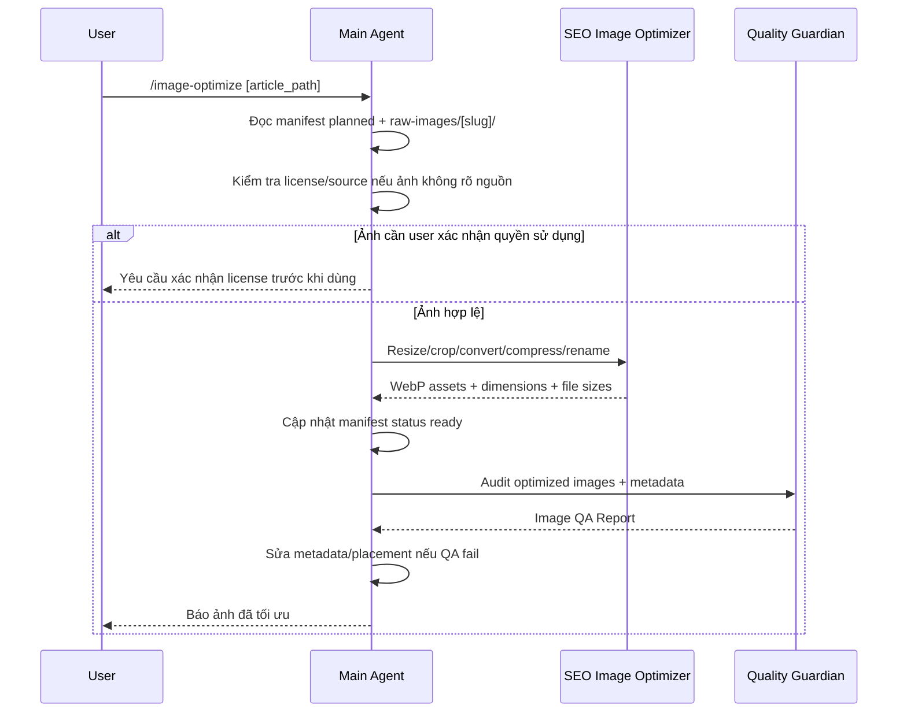
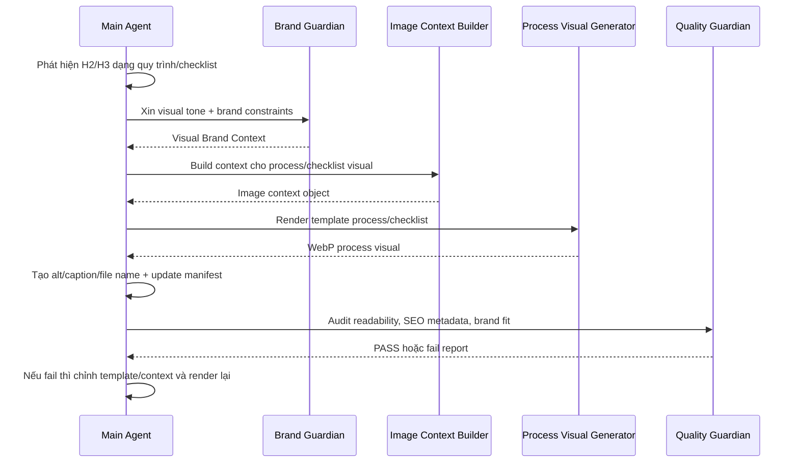
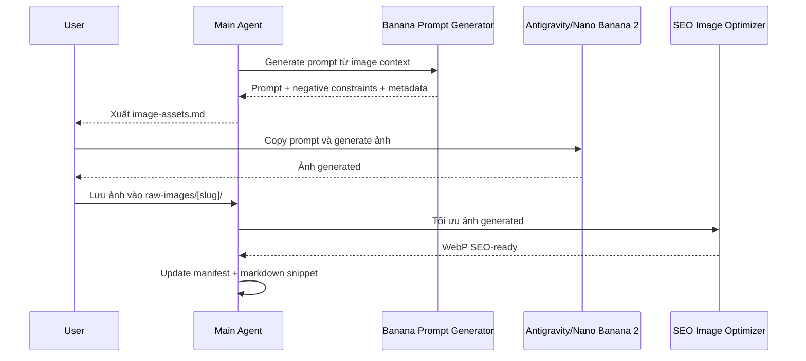
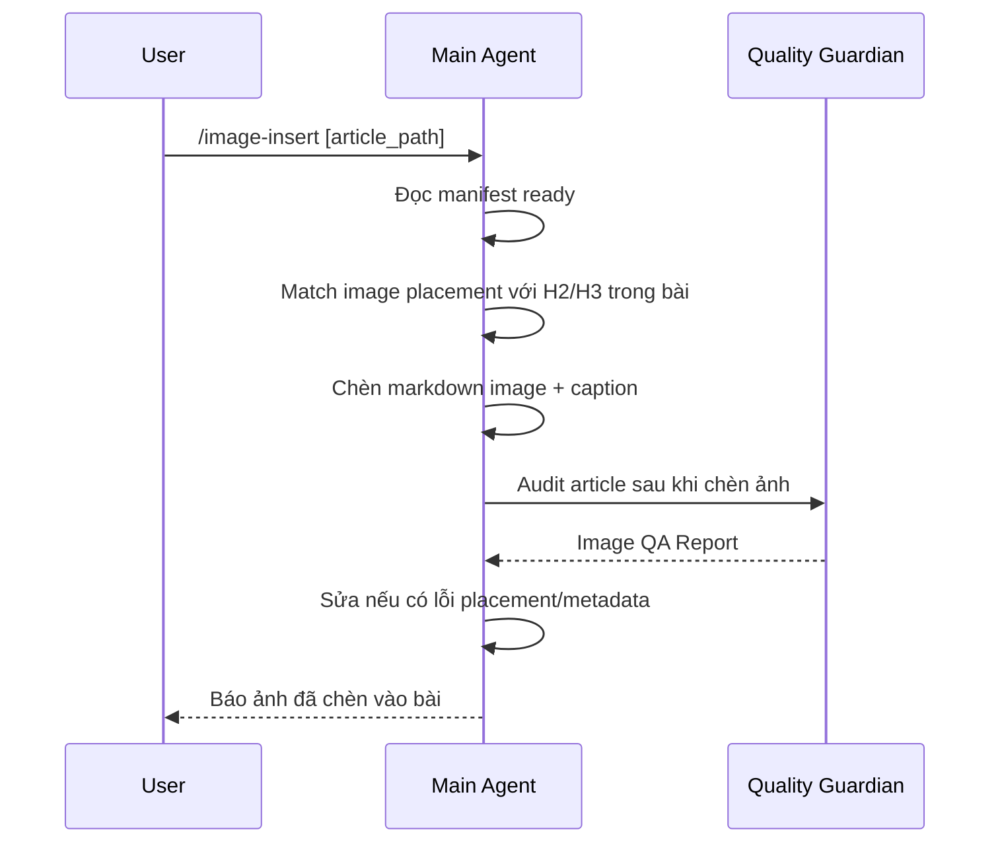

# Plan — SEO Image Assets & Image Optimizer Agent

## 1. Mục tiêu

Mở rộng hệ thống SEO Content hiện tại để hỗ trợ tạo và tối ưu hình ảnh cho bài viết, ưu tiên các loại ảnh có giá trị SEO cao, chi phí thấp và dễ tự động hóa:

- Ảnh quy trình.
- Ảnh checklist.
- Ảnh so sánh.
- Ảnh infographic đơn giản.
- Tối ưu ảnh có sẵn từ raw images, ảnh stock, ảnh khách hàng cung cấp hoặc ảnh tham khảo hợp lệ.

Nguyên tắc kiến trúc không thay đổi:

> **Main Agent là tác nhân thực thi duy nhất. Sub-agents chỉ thu thập context, audit hoặc đề xuất. Sub-agents không viết bài, không chỉnh bài, không tạo/chỉnh file ảnh cuối cùng và không tự publish.**

---

## 2. Phạm vi triển khai

### In scope

- Thiết kế image context chuẩn cho từng bài SEO.
- Tạo image plan cho bài viết dựa trên outline/content brief.
- Tạo prompt cho Nano Banana 2 / Antigravity khi cần ảnh AI.
- Tạo ảnh quy trình/checklist bằng template hoặc prompt.
- Tối ưu ảnh có sẵn:
  - Rename chuẩn SEO.
  - Resize/crop theo placement.
  - Convert WebP.
  - Compress.
  - Tạo alt/title/caption.
  - Sinh image manifest.
  - Chèn markdown image vào bài.
- Thêm QA checklist cho chất lượng ảnh và metadata.

### Out of scope ở giai đoạn đầu

- Auto-call Gemini API để generate ảnh hàng loạt.
- Auto-upload CMS.
- Tự động scrape/download ảnh Google không rõ license.
- Sub-agent trực tiếp chỉnh sửa bài viết hoặc file ảnh.

---

## 3. Nguyên tắc vận hành Main Agent / Sub-agents

### Main Agent

Main Agent là orchestrator và executor. Main Agent chịu trách nhiệm:

- Nhận lệnh người dùng.
- Đọc article context, brand context, SEO context.
- Gọi sub-agents khi cần thu thập hoặc audit context.
- Quyết định ảnh nào cần tạo/tối ưu.
- Tạo hoặc cập nhật file plan/manifest/prompt.
- Thực thi xử lý ảnh bằng script/tool.
- Chèn ảnh vào bài viết.
- Gửi kết quả cuối cho user.

### Sub-agents

Sub-agents chỉ trả về context hoặc audit report. Không được:

- Viết nội dung bài hoàn chỉnh.
- Rewrite bài.
- Chỉnh markdown article.
- Tạo file ảnh final.
- Rename/crop/convert ảnh.
- Publish hoặc upload.

Sub-agents được phép:

- Thu thập SERP image patterns.
- Đề xuất image opportunities.
- Đề xuất brand visual rules.
- Audit alt/caption/image placement.
- Đánh giá ảnh có khớp context không.

---

## 4. Kiến trúc đề xuất

| Thành phần | Loại | Vai trò | Có thực thi không? |
| :--- | :--- | :--- | :--- |
| Main Agent | Orchestrator/Executor | Tổng hợp context, tạo plan ảnh, chạy optimize, chèn ảnh | Có |
| SEO Collector | Sub-agent | Thu thập SERP context và image opportunities từ đối thủ | Không |
| Brand Guardian | Sub-agent | Cung cấp visual brand rules, tone, anti-AI visual constraints | Không |
| Quality Guardian | Sub-agent | Audit image metadata, placement, SEO/brand compliance | Không |
| Research Agent | Sub-agent | Cập nhật brand assets/knowledge base nếu thiếu | Không |
| Image Context Builder | Skill | Chuẩn hóa context object cho ảnh | Không tự thực thi |
| Process Visual Generator | Skill/Script | Render ảnh quy trình/checklist theo template dưới quyền Main Agent | Chỉ khi Main Agent gọi |
| SEO Image Optimizer | Skill/Script | Resize/crop/convert/compress/rename ảnh dưới quyền Main Agent | Chỉ khi Main Agent gọi |

---

## 5. Mối liên hệ với agent system hiện có

Image Assets flow không tạo thêm một sub-agent thực thi mới. Đây là một năng lực mở rộng của **Main Agent**, sử dụng các sub-agents hiện có để lấy context và audit.

### Relationship map



### Vai trò trong image flow

| Agent/Skill | Khi nào được gọi | Input từ Main Agent | Output trả về | Giới hạn |
| :--- | :--- | :--- | :--- | :--- |
| SEO Collector | Khi `/write` có SERP hoặc `/image-plan --with-serp` | Keyword, topic, outline hiện có | Image opportunities, SERP visual patterns, gaps | Không tạo ảnh, không sửa outline |
| Brand Guardian | Khi cần visual tone hoặc optimize bài cũ | Topic, persona, article context | Visual brand rules, trust signals, visual avoid-list | Không rewrite, không chèn ảnh |
| Research Agent | Khi thiếu brand assets hoặc KB chưa đủ | Scope cần bổ sung | Brand colors, product context, verified/assumed info | Không xử lý ảnh |
| Quality Guardian | Sau khi Main Agent đã có manifest/snippets | Article path, manifest, metadata | Image QA Report | Không sửa file |
| Image Context Builder | Khi Main Agent cần chuẩn hóa dữ liệu ảnh | Article + SEO + Brand context | Image context object | Không gọi tool ngoài |
| Banana Prompt Generator | Khi cần dùng Antigravity/Nano Banana 2 | Image context object | Prompt + negative constraints + metadata draft | Không generate ảnh trực tiếp ở giai đoạn đầu |
| Process Visual Generator | Khi có quy trình/checklist/template visual | Image context object | Asset render dưới quyền Main Agent | Chỉ chạy khi Main Agent gọi |
| SEO Image Optimizer | Khi có raw image | Raw image + image context | WebP + metadata + manifest update | Chỉ chạy khi Main Agent gọi |

---

## 6. Sequence diagrams theo use case

### Use case 1 — `/write [keyword]` có image planning

Mục tiêu: khi viết bài mới, Main Agent tạo bài như bình thường, đồng thời lập kế hoạch ảnh dựa trên SERP, brand và outline.



Nguyên tắc:

- SEO Collector chỉ báo đối thủ đang dùng ảnh kiểu gì và section nào nên có visual.
- Brand Guardian chỉ đưa ràng buộc visual/brand.
- Main Agent là bên duy nhất quyết định ảnh nào được đưa vào plan.

### Use case 2 — `/image-plan [article_path]`

Mục tiêu: tạo kế hoạch ảnh cho một outline/draft/final article đã có.



### Use case 3 — `/image-optimize [article_path]`

Mục tiêu: user đã có ảnh raw, Main Agent tối ưu thành asset SEO-ready.



Nguyên tắc:

- Optimizer là script/skill chạy dưới quyền Main Agent.
- Quality Guardian chỉ trả report, không sửa ảnh/manifest.

### Use case 4 — Process visual tự động bằng template

Mục tiêu: Main Agent tạo ảnh quy trình/checklist từ nội dung bài mà không cần AI image API.



### Use case 5 — Dùng Antigravity/Nano Banana 2 bán tự động

Mục tiêu: tận dụng Nano Banana 2 trong Antigravity với chi phí thấp, không cần API ở giai đoạn đầu.



### Use case 6 — `/image-insert [article_path]`

Mục tiêu: chèn ảnh đã ready vào bài theo manifest.



---

## 7. Interaction contracts

### Contract 1 — Main Agent gọi SEO Collector

Input:

```json
{
  "keyword": "",
  "article_title": "",
  "outline": [],
  "request": "collect_image_opportunities_only"
}
```

Output:

```markdown
### Image Opportunities

- SERP visual patterns:
  - Top competitors use: [screenshots / diagrams / process visuals / stock photos]
- Sections where visuals are expected:
  - [H2 title] → [recommended image type]
- Visual content gaps:
  - [gap]
- Recommended image assets:
  1. [type] — [section] — [reason]
```

### Contract 2 — Main Agent gọi Brand Guardian

Input:

```json
{
  "topic": "",
  "persona": "",
  "article_context": {},
  "request": "visual_brand_context_only"
}
```

Output:

```markdown
### Visual Brand Context

- Visual tone:
- Preferred trust signals:
- Brand-safe visual metaphors:
- Avoid:
- Recommended color/style direction:
```

### Contract 3 — Main Agent gọi Quality Guardian

Input:

```json
{
  "article_path": "",
  "manifest_path": "",
  "request": "image_qa_only"
}
```

Output:

```markdown
### Image QA Report

- Overall: PASS/FAIL
- Asset checks:
  - [asset_id] SEO metadata: PASS/FAIL
  - [asset_id] Placement relevance: PASS/FAIL
  - [asset_id] Brand fit: PASS/FAIL
  - [asset_id] Performance: PASS/FAIL
  - [asset_id] Copyright risk: PASS/FAIL/NEEDS_CONFIRMATION
- Required fixes for Main Agent:
  - [fix]
```

### Contract 4 — Main Agent gọi Research Agent

Input:

```json
{
  "scope": "brand_assets",
  "missing_fields": ["brand_colors", "logo_policy", "visual_tone"]
}
```

Output:

```markdown
### Brand Asset Context

- Brand colors: [verified/assumed/TBD]
- Logo usage: [verified/assumed/TBD]
- Visual tone: [verified/assumed/TBD]
- Missing confirmations:
  - [question]
```

---

## 8. Image context object chuẩn

Mỗi ảnh nên có một context object thống nhất để Main Agent và các skill cùng hiểu.

```json
{
  "business_context": {
    "brand": "HVS Securities",
    "industry": "chứng khoán và tài chính",
    "market": "Việt Nam",
    "tone": "thực chiến, rõ ràng, đáng tin cậy"
  },
  "article_context": {
    "title": "",
    "primary_keyword": "",
    "search_intent": "",
    "persona": "",
    "funnel_stage": "",
    "main_message": ""
  },
  "image_context": {
    "type": "process_visual",
    "placement": "after_h2",
    "target_section": "",
    "goal": "giúp người đọc hiểu nhanh quy trình",
    "content_units": []
  },
  "visual_direction": {
    "style": "clean editorial infographic",
    "composition": "16:9 horizontal process flow",
    "color_palette": [],
    "include_text": true,
    "text_language": "vi"
  },
  "technical": {
    "aspect_ratio": "16:9",
    "target_size": "1200x675",
    "format": "webp",
    "max_file_size_kb": 220
  },
  "seo_metadata": {
    "file_name": "",
    "alt": "",
    "title": "",
    "caption": ""
  },
  "avoid": [
    "watermark",
    "fake logo",
    "unreadable text",
    "AI-looking generic visual",
    "misleading financial claim"
  ]
}
```

---

## 6. Feature 1 — Process Visual Generator

### Mục tiêu

Tạo ảnh quy trình/checklist/infographic đơn giản từ nội dung bài viết. Đây là loại ảnh ưu tiên vì:

- Tăng khả năng đọc lướt.
- Tăng time-on-page.
- Dễ đồng bộ brand.
- Ít rủi ro lỗi ảnh AI.
- Có thể tạo bằng template với chi phí gần như bằng 0.

### Input

- Outline hoặc draft bài viết.
- H2/H3 có dạng quy trình, checklist, so sánh, timeline.
- Brand colors nếu có.
- Keyword chính.
- Persona.

### Output

- Image context object.
- Visual spec.
- File ảnh final do Main Agent tạo.
- SEO metadata.
- Markdown snippet để chèn vào bài.

### Các template nên hỗ trợ trước

1. `process-steps-horizontal`
   - Dùng cho quy trình 3-7 bước.
   - Format 16:9.

2. `checklist-card-grid`
   - Dùng cho checklist 4-8 mục.
   - Format 16:9 hoặc 4:5.

3. `comparison-two-column`
   - Dùng cho trước/sau, nên/không nên, tự làm/thuê chuyên gia.

4. `benefit-cards`
   - Dùng cho lợi ích chính của sản phẩm/dịch vụ.

5. `timeline-simple`
   - Dùng cho lộ trình học, quy trình mở tài khoản, quy trình đầu tư.

### Luồng xử lý

```text
Main Agent đọc article/outline
→ Main Agent phát hiện section có thể tạo visual
→ SEO Collector cung cấp SERP image pattern nếu cần
→ Brand Guardian cung cấp visual constraints nếu cần
→ Main Agent tạo image context object
→ Main Agent gọi Process Visual Generator
→ Script render HTML/SVG/PNG/WebP
→ Main Agent tạo metadata
→ Main Agent chèn markdown image vào bài
→ Quality Guardian audit
```

### Quy tắc quan trọng

- Sub-agent không render ảnh.
- Sub-agent không chèn ảnh vào bài.
- Skill/script chỉ chạy khi Main Agent gọi.
- Main Agent luôn lưu manifest để truy vết.

---

## 7. Feature 2 — SEO Image Optimizer

### Mục tiêu

Tối ưu ảnh có sẵn thành asset SEO-ready.

Nguồn ảnh có thể là:

- Ảnh khách hàng cung cấp.
- Ảnh tự chụp.
- Ảnh stock có license.
- Ảnh AI đã generate bằng Antigravity/Nano Banana 2.
- Ảnh tham khảo hợp lệ.

### Cảnh báo bản quyền

Không mặc định sử dụng ảnh lấy từ Google Images nếu không rõ license. Main Agent phải nhắc user xác nhận quyền sử dụng nếu ảnh không đến từ nguồn rõ ràng.

### Input

```json
{
  "raw_image_path": "content/blog/assets/raw/example.png",
  "article_context": {
    "title": "",
    "primary_keyword": "",
    "target_section": ""
  },
  "image_context": {
    "type": "featured_image",
    "placement": "top_of_article",
    "description": ""
  }
}
```

### Output

```json
{
  "source": "content/blog/assets/raw/example.png",
  "output": "content/blog/assets/images/seo-friendly-file-name.webp",
  "width": 1200,
  "height": 675,
  "format": "webp",
  "file_size_kb": 180,
  "alt": "",
  "title": "",
  "caption": "",
  "markdown": ""
}
```

### Transform rules

| Placement | Ratio | Target size | Max size |
| :--- | :--- | :--- | :--- |
| Featured image | 16:9 | 1200x675 | 220 KB |
| OG image | 1.91:1 | 1200x630 | 250 KB |
| Inline article image | 16:9 | 1000x562 hoặc 1200x675 | 200 KB |
| Square social | 1:1 | 1080x1080 | 250 KB |
| Vertical social | 4:5 | 1080x1350 | 300 KB |
| Thumbnail | 16:9 | 600x338 | 100 KB |

### Filename rules

- Lowercase.
- Không dấu tiếng Việt.
- Dùng dấu gạch ngang.
- Có keyword chính nếu tự nhiên.
- Không quá dài.
- Không nhồi keyword.

Ví dụ:

```text
quy-trinh-mo-tai-khoan-chung-khoan.webp
```

### Alt text rules

- Mô tả đúng ảnh.
- Có keyword tự nhiên nếu phù hợp.
- Không nhồi keyword.
- Không dùng alt chung chung như `hình ảnh minh họa`.

---

## 8. Feature 3 — Banana Prompt Generator

### Mục tiêu

Tận dụng Nano Banana 2 trong Antigravity theo hướng rẻ trước: Main Agent tạo prompt + metadata, user hoặc Antigravity generate ảnh, sau đó Main Agent tối ưu ảnh.

### Input

- Article context.
- Image context.
- Brand visual direction.
- Placement.
- Desired aspect ratio.

### Output

- Prompt cho Nano Banana 2.
- Negative constraints.
- File name đề xuất.
- Alt/caption/title.
- Instruction tải ảnh vào thư mục raw.

### Workflow bán tự động

```text
Main Agent tạo image-assets.md
→ User/Antigravity dùng prompt để generate ảnh
→ User lưu ảnh vào raw-images/
→ Main Agent chạy SEO Image Optimizer
→ Main Agent chèn ảnh vào bài
```

### Khi nào dùng Banana

- Featured image cần cảm giác editorial/professional.
- Infographic có text đơn giản.
- Mockup UI hoặc visual concept.
- Ảnh social cần hấp dẫn hơn template.

### Khi nào không cần Banana

- Quy trình đơn giản.
- Checklist.
- So sánh bảng.
- Benefit cards.

Các trường hợp này nên ưu tiên template để rẻ và ổn định.

---

## 9. File/folder convention đề xuất

```text
content/blog/
├── 0-raw/
├── 1-outlines/
├── 2-drafts/
├── 3-final/
└── assets/
    ├── raw-images/
    ├── images/
    ├── manifests/
    └── prompts/
```

Với mỗi bài:

```text
content/blog/assets/
├── raw-images/[slug]/
│   ├── 01-featured.png
│   └── 02-process-source.png
├── images/[slug]/
│   ├── featured-[slug].webp
│   └── quy-trinh-[slug].webp
├── manifests/[slug].image-manifest.json
└── prompts/[slug].image-assets.md
```

---

## 10. Image manifest chuẩn

Main Agent phải tạo hoặc cập nhật manifest sau mỗi lần xử lý ảnh.

```json
{
  "article_slug": "",
  "article_path": "",
  "generated_at": "",
  "images": [
    {
      "id": "img_001",
      "type": "process_visual",
      "placement": "after_h2",
      "section": "",
      "source": "",
      "output": "",
      "alt": "",
      "title": "",
      "caption": "",
      "width": 1200,
      "height": 675,
      "format": "webp",
      "status": "ready",
      "created_by": "main_agent",
      "context_sources": [
        "seo_collector",
        "brand_guardian"
      ]
    }
  ]
}
```

---

## 11. Slash command đề xuất

### `/image-plan [article_path]`

Main Agent phân tích bài/outline và tạo image plan.

Output:

- `assets/prompts/[slug].image-assets.md`
- `assets/manifests/[slug].image-manifest.json` ở trạng thái `planned`

### `/image-optimize [article_path]`

Main Agent tối ưu ảnh raw đã có cho bài.

Output:

- WebP images trong `assets/images/[slug]/`
- Manifest cập nhật `ready`
- Markdown snippets đề xuất hoặc chèn trực tiếp nếu mode cho phép

### `/image-insert [article_path]`

Main Agent chèn ảnh đã ready vào bài theo manifest.

### `/image-qa [article_path]`

Main Agent gửi manifest + bài cho Quality Guardian audit. Quality Guardian chỉ trả report, Main Agent sửa.

---

## 12. Sub-agent context snippets cần bổ sung

### SEO Collector — Image Opportunities

SEO Collector có thể bổ sung block sau vào SERP report:

```markdown
### Image Opportunities

- Competitor image patterns: [featured photo / infographic / table screenshot / diagram]
- Sections where visuals are common: [H2/H3]
- Featured snippet visual chance: [process/list/table]
- Recommended visual assets:
  1. [type] — [section] — [reason]
```

### Brand Guardian — Visual Brand Context

Brand Guardian trả về:

```markdown
### Visual Brand Context

- Visual tone: [clean / practical / finance-focused / human]
- Preferred colors: [if known]
- Avoid visuals: [generic AI finance charts, luxury cliché, fake logos]
- Required trust signals: [real platform UI, Vietnamese market context, concrete numbers]
```

### Quality Guardian — Image QA Report

Quality Guardian trả về:

```markdown
### Image QA Report

- SEO metadata: PASS/FAIL
- Placement relevance: PASS/FAIL
- Brand fit: PASS/FAIL
- Copyright risk: PASS/FAIL/NEEDS_CONFIRMATION
- File size/performance: PASS/FAIL
- Issues:
  - [line/asset id] [issue] → [recommended fix]
```

---

## 13. Implementation phases

### Phase 1 — Planning & Prompt-only image workflow

Mục tiêu: triển khai nhanh, không phụ thuộc API.

Tasks:

- Tạo image context schema.
- Tạo `image-assets.md` template.
- Tạo manifest template.
- Thêm image opportunities vào SEO Collector output.
- Thêm visual brand context vào Brand Guardian output.
- Main Agent tạo prompt cho Nano Banana 2/Antigravity.

Acceptance criteria:

- Với một outline, Main Agent tạo được image plan gồm 1 featured image và 1-3 ảnh process/checklist nếu phù hợp.
- Sub-agents chỉ trả context, không edit file bài.
- Có manifest trạng thái `planned`.

### Phase 2 — SEO Image Optimizer

Mục tiêu: xử lý ảnh có sẵn thành ảnh SEO-ready.

Tasks:

- Tạo script resize/crop/convert WebP/compress.
- Tạo filename slugifier tiếng Việt.
- Tạo alt/caption/title generator.
- Tạo manifest updater.
- Cho phép Main Agent chèn markdown image.

Acceptance criteria:

- Raw image được convert sang WebP đúng kích thước.
- File name SEO-friendly.
- Manifest có đầy đủ output path, size, alt, caption.
- Main Agent chèn ảnh đúng placement.

### Phase 3 — Process Visual Generator

Mục tiêu: tạo ảnh quy trình/checklist bằng template.

Tasks:

- Xây template HTML/SVG cho process steps.
- Xây template checklist/card grid.
- Xây template comparison two-column.
- Render thành PNG/WebP.
- Áp brand colors.

Acceptance criteria:

- Tạo được ảnh process 3-7 bước từ section outline.
- Text tiếng Việt rõ, không lỗi font.
- Output dưới giới hạn file size.
- Có metadata SEO và manifest.

### Phase 4 — Image QA Loop

Mục tiêu: đảm bảo ảnh khớp SEO/brand/performance.

Tasks:

- Bổ sung Image QA Report cho Quality Guardian.
- Main Agent gửi manifest + markdown snippets cho QA.
- Main Agent sửa theo QA report.

Acceptance criteria:

- Quality Guardian chỉ trả report.
- Main Agent là bên duy nhất sửa manifest/article/assets.
- Mỗi ảnh có PASS/FAIL rõ ràng.

### Phase 5 — Optional Gemini API automation

Mục tiêu: tự động generate ảnh khi cần scale.

Điều kiện bắt đầu:

- User xác nhận muốn dùng API và chấp nhận chi phí.
- Có `GEMINI_API_KEY` hoặc Vertex AI setup.
- Có pricing policy rõ.

Tasks:

- Thêm Gemini Image Client.
- Hỗ trợ model `gemini-3.1-flash-image-preview` hoặc model image phù hợp thời điểm triển khai.
- Thêm cost guardrail.
- Lưu source prompt và metadata.

Acceptance criteria:

- Không hardcode API key.
- Có dry-run mode.
- Có giới hạn số ảnh/lượt chạy.
- Có manifest provenance.

---

## 14. Quality checklist

Trước khi hoàn tất một bài có ảnh, Main Agent phải kiểm tra:

- [ ] Mỗi ảnh có purpose rõ ràng.
- [ ] Mỗi ảnh khớp section đang chèn.
- [ ] Filename không dấu, lowercase, có nghĩa.
- [ ] Alt text mô tả đúng ảnh, không keyword stuffing.
- [ ] Caption bổ sung giá trị cho người đọc.
- [ ] File là WebP hoặc format được chấp nhận.
- [ ] Kích thước phù hợp placement.
- [ ] Dung lượng không quá lớn.
- [ ] Không có watermark/logo giả.
- [ ] Không dùng ảnh Google không rõ bản quyền nếu chưa được xác nhận.
- [ ] Manifest đã cập nhật.
- [ ] Quality Guardian pass hoặc các lỗi đã được Main Agent sửa.

---

## 15. Rủi ro và guardrails

### Rủi ro bản quyền

Guardrail:

- Nếu ảnh nguồn không rõ license, Main Agent phải đánh dấu `NEEDS_CONFIRMATION`.
- Không publish ảnh đó nếu user chưa xác nhận quyền sử dụng.

### Rủi ro AI-looking visual

Guardrail:

- Ưu tiên template cho process/checklist.
- Dùng Banana/Nano Banana cho featured hoặc creative asset khi cần.
- Quality Guardian audit brand fit.

### Rủi ro sai thông tin tài chính

Guardrail:

- Infographic có số liệu phải trích nguồn từ content brief hoặc verified resources.
- Không tự bịa số liệu trong ảnh.

### Rủi ro sub-agent vượt quyền

Guardrail:

- Agent instruction phải ghi rõ: sub-agent chỉ trả context/report.
- Main Agent là executor duy nhất.
- Manifest field `created_by` luôn là `main_agent` cho final assets.

---

## 16. Definition of Done

Tính năng SEO Image Assets được xem là hoàn thành khi:

- Main Agent tạo được image plan từ outline/draft.
- Có prompt file cho Antigravity/Nano Banana 2 khi cần.
- Có thể tối ưu ảnh raw thành WebP SEO-ready.
- Có thể tạo ít nhất một loại process visual bằng template.
- Có manifest cho mọi ảnh.
- Có QA report cho ảnh.
- Sub-agents không thực thi chỉnh sửa hoặc tạo final assets.
- Toàn bộ flow phù hợp nguyên tắc trong `CLAUDE.md`: **Chỉ Main Agent viết bài/thực thi; Sub-agents chỉ thu thập context.**
