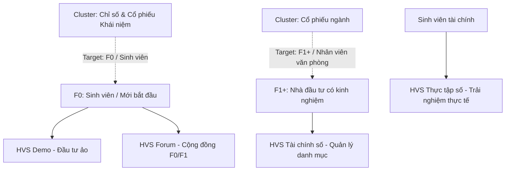
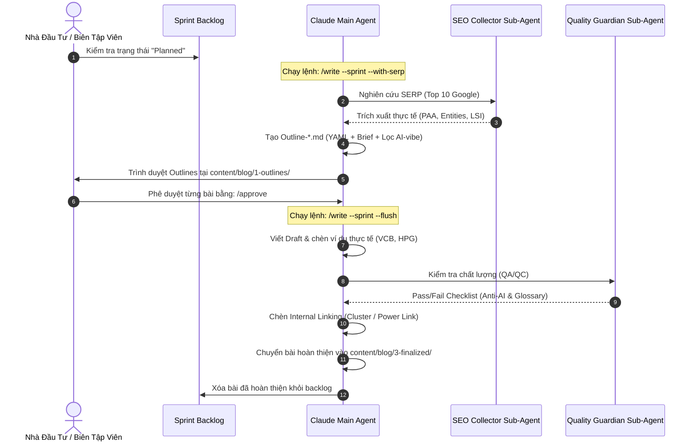

# HVS Securities — Content Production Plan (40 Articles)

Bản kế hoạch chi tiết này quy hoạch lộ trình sản xuất **40 bài viết tài chính SEO** (gồm 29 bài Cổ phiếu ngành, 7 bài Chỉ số chứng khoán, và 4 bài Cổ phiếu khái niệm) nhằm tối ưu hóa phễu chuyển đổi cho HVS Securities. 

Triết lý cốt lõi: **Triệt tiêu hoàn toàn "AI-vibe"**, lồng ghép khéo léo hệ sinh thái sản phẩm HVS theo đúng phân khúc độc giả (Persona).

---

## 1. Bản Đồ Phễu Chuyển Đổi Persona & Sản Phẩm HVS

Mỗi bài viết tài chính của HVS không chỉ đơn thuần cung cấp kiến thức, mà phải đóng vai trò dẫn dắt người đọc trải nghiệm các giải pháp thực tế trong hệ sinh thái sản phẩm HVS.



### Bản đồ ánh xạ chi tiết:
*   **HVS Demo (Đầu tư ảo không rủi ro):** Tích hợp vào các bài viết cơ bản dành cho **F0, Sinh viên** nhằm giúp họ thực hành giao dịch ngay lập tức (e.g., *Cách mua cổ phiếu, Cổ phiếu lô lẻ, Chỉ số VN-Index*).
*   **HVS Forum (Học từ cộng đồng):** Tích hợp vào các bài viết chia sẻ kinh nghiệm, phân tích cơ bản dành cho **F0 và F1** học hỏi lẫn nhau.
*   **HVS Tài chính số (Quản lý danh mục chuyên nghiệp):** Tích hợp vào các bài viết nâng cao, phân tích ngành dành cho **F1+ và Nhân viên văn phòng** đang tìm kiếm công cụ tối ưu hóa hiệu suất đầu tư.
*   **HVS Thực tập số (Trải nghiệm thực tế):** Tích hợp vào các bài viết mang tính học thuật, định hướng nghề nghiệp dành cho đối tượng **Sinh viên**.

---

## 2. Quy Hoạch Chi Tiết 3 Cụm Chủ Đề (Topic Clusters)

### 2.1. Cụm Chủ Đề: Cổ Phiếu Ngành (29 Bài viết)
*   **Hiện trạng:** Đã xuất bản 1 bài viết Pillar (`cổ phiếu đầu cơ`). Còn lại **28 bài viết đang ở trạng thái Lên kế hoạch (Planned)**.
*   **Mục tiêu:** Cung cấp bức tranh toàn cảnh về từng nhóm ngành trên sàn HOSE/HNX, phân tích đặc thù chu kỳ kinh doanh và liệt kê các mã cổ phiếu tiêu biểu (ví dụ: VCB, HPG, VNM, PVD...).
*   **Persona:** Nhân viên văn phòng, Sinh viên tài chính (F1+).
*   **Sản phẩm HVS tích hợp:** *HVS Tài chính số* (phân tích danh mục ngành) & *HVS Thực tập số*.

| CSV # | Keyword | Loại bài | Persona | Trạng thái |
| :--- | :--- | :--- | :--- | :--- |
| 190 | cổ phiếu dầu khí | Phân tích ngành | NV văn phòng, Sinh viên | Planned |
| 191 | cổ phiếu cảng biển | Phân tích ngành | NV văn phòng, Sinh viên | Planned |
| 192 | cổ phiếu ngành chứng khoán | Phân tích ngành | NV văn phòng, Sinh viên | Planned |
| 193 | cổ phiếu điện lực | Phân tích ngành | NV văn phòng, Sinh viên | Planned |
| 194 | cổ phiếu bất động sản | Phân tích ngành | NV văn phòng, Sinh viên | Planned |
| 195 | cổ phiếu ngành cao su | Phân tích ngành | NV văn phòng, Sinh viên | Planned |
| 196 | cổ phiếu ngành dược | Phân tích ngành | NV văn phòng, Sinh viên | Planned |
| 197 | cổ phiếu ngành thép | Phân tích ngành | NV văn phòng, Sinh viên | Planned |
| 198 | cổ phiếu ngân hàng | Phân tích ngành | NV văn phòng, Sinh viên | Planned |
| 199 | cổ phiếu đầu tư công | Phân tích ngành | NV văn phòng, Sinh viên | Planned |
| 200 | cổ phiếu xuất nhập khẩu | Phân tích ngành | NV văn phòng, Sinh viên | Planned |
| 202 | cổ phiếu hàng không | Phân tích ngành | NV văn phòng, Sinh viên | Planned |
| 203 | cổ phiếu ngành xây dựng | Phân tích ngành | NV văn phòng, Sinh viên | Planned |
| 204 | cổ phiếu ngành dệt may | Phân tích ngành | NV văn phòng, Sinh viên | Planned |
| 205 | cổ phiếu ngành công nghệ | Phân tích ngành | NV văn phòng, Sinh viên | Planned |
| 206 | cổ phiếu ngành thủy sản | Phân tích ngành | NV văn phòng, Sinh viên | Planned |
| 207 | cổ phiếu ngành thực phẩm | Phân tích ngành | NV văn phòng, Sinh viên | Planned |
| 208 | cổ phiếu ngành bán lẻ | Phân tích ngành | NV văn phòng, Sinh viên | Planned |
| 209 | cổ phiếu ngành nhựa | Phân tích ngành | NV văn phòng, Sinh viên | Planned |
| 210 | cổ phiếu ngành du lịch | Phân tích ngành | NV văn phòng, Sinh viên | Planned |
| 211 | cổ phiếu ngành năng lượng | Phân tích ngành | NV văn phòng, Sinh viên | Planned |
| 212 | cổ phiếu ngành y tế | Phân tích ngành | NV văn phòng, Sinh viên | Planned |
| 213 | cổ phiếu ngành Truyền Thông | Phân tích ngành | NV văn phòng, Sinh viên | Planned |
| 214 | Cổ phiếu ngành ô tô | Phân tích ngành | NV văn phòng, Sinh viên | Planned |
| 215 | Cổ phiếu ngành bảo hiểm | Phân tích ngành | NV văn phòng, Sinh viên | Planned |
| 216 | cổ phiếu ngành than | Phân tích ngành | NV văn phòng, Sinh viên | Planned |
| 217 | cổ phiếu ngành hóa chất | Phân tích ngành | NV văn phòng, Sinh viên | Planned |
| 218 | cổ phiếu ngành nông nghiệp | Phân tích ngành | NV văn phòng, Sinh viên | Planned |

> [!NOTE]
> Bài viết thứ 29 trong cụm này là **"cổ phiếu đầu cơ"** (Pillar) đã được xuất bản hoàn chỉnh (`Final-co-phieu-dau-co.md`), do đó chúng ta chỉ nạp 28 bài viết còn lại vào Backlog sản xuất.

---

### 2.2. Cụm Chủ Đề: Chỉ Số Chứng Khoán (7 Bài viết)
*   **Hiện trạng:** Đã xuất bản 6 bài viết (bao gồm cả Pillar `Chỉ số DAX là gì`). Đang triển khai 3 bài viết ở giai đoạn Outline. Còn lại **4 bài viết cần lên kế hoạch sản xuất**.
*   **Mục tiêu:** Cung cấp thông tin khách quan về cách tính, ý nghĩa và vai trò của các chỉ số lớn toàn cầu và nội địa (Nikkei, Dow Jones, Nasdaq, MSCI, DXY, Hang Seng, các chỉ số VN).
*   **Persona:** F0 mới làm quen thị trường toàn cầu.
*   **Sản phẩm HVS tích hợp:** *HVS Forum* (thảo luận vĩ mô) & *HVS Demo* (theo dõi chỉ số).

| CSV # | Keyword | Loại bài | Persona | Trạng thái | Ghi chú |
| :--- | :--- | :--- | :--- | :--- | :--- |
| 41 | chỉ số nikkei là gì | Định nghĩa | F0 | Outline-Pending | Đã có Outline sẵn sàng |
| 43 | chỉ số dow jones | Định nghĩa | F0 | Outline-Pending | Đã có Outline sẵn sàng |
| 44 | chỉ số nasdaq là gì | Định nghĩa | F0 | Outline-Pending | Đã có Outline sẵn sàng |
| 45 | Chỉ số msci là gì | Định nghĩa | F0 | Planned | Tạo outline mới |
| 46 | Chỉ số DXY là gì | Định nghĩa | F0 | Planned | Tạo outline mới |
| 50 | các chỉ số chứng khoán việt nam | Tổng hợp | Sinh viên, NV văn phòng | Planned | Tạo outline mới |
| 53 | chỉ số hang seng là gì | Định nghĩa | F0 | Planned | Tạo outline mới |

---

### 2.3. Cụm Chủ Đề: Cổ Phiếu Khái Niệm (4 Bài viết Chọn Lọc)
Từ danh sách 20 từ khóa "Planned" của Cluster Cổ phiếu, chúng tôi lựa chọn ra **4 bài viết chiến lược nhất** để đưa vào Backlog sản xuất. Đây là những khái niệm nền tảng mà mọi F0 bắt buộc phải nắm rõ trước khi bắt đầu giao dịch thực tế.

*   **Mục tiêu:** Định nghĩa rõ ràng, chính xác các khái niệm cấu trúc của cổ phiếu trên thị trường chứng khoán Việt Nam.
*   **Persona:** F0, Sinh viên.
*   **Sản phẩm HVS tích hợp:** *HVS Demo* & *HVS Forum*.

| CSV # | Keyword | Lý do lựa chọn chiến lược | Persona | Trạng thái |
| :--- | :--- | :--- | :--- | :--- |
| 165 | Cổ phiếu OTC là gì | Giúp F0 hiểu thị trường phi tập trung trước khi giao dịch thực tế | F0 | Planned |
| 167 | cổ phiếu lô lẻ là gì | Giải quyết bài toán giao dịch vốn nhỏ của sinh viên trên HOSE (lô 1-99) | F0 | Planned |
| 184 | Cổ phiếu quỹ là gì | Giải thích hành vi mua lại cổ phiếu của doanh nghiệp ảnh hưởng đến cổ đông | F0 | Planned |
| 185 | cổ phiếu ưu đãi là gì | Phân biệt quyền lợi cổ đông thường vs cổ đông ưu đãi (quyết định, cổ tức) | F0 | Planned |

---

## 3. Lộ Trình Triển Khai Thực Chiến (Action Plan)

Quy trình sản xuất nội dung tuân thủ nghiêm ngặt mô hình **Layer 3 Content Pipeline** trong `CLAUDE.md`.



### Bước 1: Khởi động Sprint & Tạo Outlines Hàng Loạt
Nhà biên tập chạy lệnh dưới đây để tự động tạo outline cho **tất cả 35 từ khóa ở trạng thái `Planned`**:
```powershell
/write --sprint --with-serp
```
*Hệ thống sẽ tự động gọi **SEO Collector** để quét SERP thực tế cho từng từ khóa, xây dựng cấu trúc Outline chi tiết kèm theo các cảnh báo Anti-AI cụ thể.*

### Bước 2: Duyệt Outlines
Kiểm tra các file Outline được sinh ra trong `content/blog/1-outlines/Outline-[slug].md`. Sau khi ưng ý, duyệt từng bài bằng cách mở file outline đó và chạy:
```powershell
/approve
```
*Lệnh này sẽ chuyển trạng thái của bài viết trong `sprint-backlog.md` từ `Outline-Pending` sang `Outline-Approved`.*

### Bước 3: Viết & Xuất Bản Hàng Loạt (Flush Pipeline)
Sau khi đã phê duyệt danh sách outlines, chạy lệnh sau để hệ thống tự động hoàn thiện toàn bộ bài viết thành bản Finalized:
```powershell
/write --sprint --flush
```
*Hệ thống sẽ chạy qua 3 bước khép kín:*
1.  **Writing:** Viết chi tiết bài viết với ví dụ thực tế (VCB, VNM, HPG, % phí cụ thể) tránh AI-vibe.
2.  **QA/QC:** Kích hoạt **Quality Guardian** để kiểm duyệt chống đạo văn, câu cú trôi chảy.
3.  **Linking:** Chạy thuật toán tự động liên kết các bài viết nội bộ cùng cluster (Same-cluster) và liên kết chéo (Cross-cluster) theo đúng quy tắc phễu.

---

> [!TIP]
> **Khuyến nghị thực thi:** Nên chia nhỏ đợt duyệt. Ví dụ, tạo outlines cho cụm bài viết *Chỉ số chứng khoán* trước, phê duyệt nhanh, rồi tiến hành *Flush* để làm quen với nhịp độ sản xuất chất lượng cao của hệ thống.
