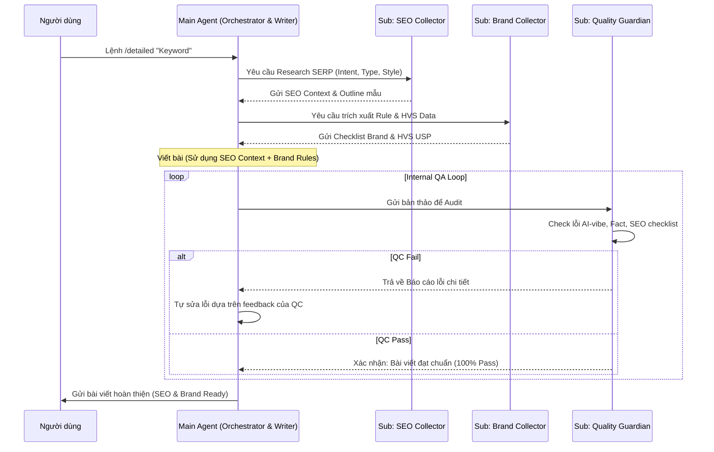

# 🗺️ Kế hoạch Triển khai Sub-Agent Framework (Phiên bản "Context Collector Army")

Hệ thống được thiết kế lại theo triết lý: **Sub-Agents là đội quân thu thập Context chất lượng cao, Main Agent là chuyên gia tổng hợp và thực thi duy nhất.**

---

## 1. Triết lý Vận hành
- **Sub-Agents:** Không tham gia viết bài (Implementation) để tránh mất nhất quán. Thay vào đó, chúng đóng vai trò là các "Thám tử dữ liệu" giúp gom tụ Context sạch, cô đọng.
- **Main Agent (Orchestrator/Writer):** Nhận "Context sạch" từ đội quân Sub-agents để thực hiện việc viết bài với giọng văn đồng nhất, logic chặt chẽ.

## 2. Các Sub-Agents "Thu thập Context" (Context Collectors)

### 🕵️ Sub-Agent 1: SEO & Competitor Analyst
- **Nhiệm vụ:** 
    - Quét file `keywords.csv` để lấy thông số Volume, Difficulty.
    - Phân tích 3 bài viết đứng đầu Google cho keyword mục tiêu (Search Intent, cấu trúc Heading).
- **Output (Context):** Một bản tóm tắt "Chiến lược SEO & Intent" (JSON hoặc Markdown ngắn).

### 📖 Sub-Agent 2: Brand & Style Guardian
- **Nhiệm vụ:**
    - Trích xuất các quy tắc phù hợp nhất từ `anti-ai-rules.md` cho chủ đề đang viết.
    - Quét các `Revision Log` gần nhất để tìm các lỗi văn phong người dùng từng góp ý.
- **Output (Context):** Bộ quy tắc "Văn phong thực chiến" cần áp dụng cho bài viết này.


---

## 3. Sequence Diagram: Quy trình "Thu thập - Viết - Kiểm soát nội bộ"

Quy trình hoạt động khép kín để đảm bảo chất lượng 100% trước khi User nhận bài:



## 4. Use Case 1: Viết bài mới (/detailed)
- **Sub-agents:** Thu thập "nguyên liệu thô" (SEO data, Brand rules).
- **Main Agent:** Nhào nặn nguyên liệu để tạo ra bài viết mới hoàn toàn.

## 5. Use Case 2: Tối ưu nội dung cũ (/optimize)
Trong trường hợp này, các Sub-agents đóng vai trò là "Nhà phê bình" và "Cố vấn":

| Sub-Agent | Hành động cụ thể | Output (Context) |
| :--- | :--- | :--- |
| **SEO Collector** | Quét bài viết cũ + So sánh với Top Google hiện tại. | Danh sách các đoạn cần bổ sung keyword, các Heading lỗi thời, hoặc các ý bị thiếu so với đối thủ. |
| **Brand Collector** | Quét bài viết cũ đối chiếu với `anti-ai-rules.md`. | Chỉ ra chính xác các câu/đoạn đang bị "AI-vibe" hoặc chưa đúng Persona của HVS. |
| **Main Agent** | Nhận bài cũ + "Đơn thuốc" từ 2 Sub-agents. | Thực hiện việc chỉnh sửa (Rewrite) tập trung vào các điểm yếu đã được chỉ ra. |

---

## 6. Ưu điểm của mô hình này
1.  **Chống "AI-vibe" tuyệt đối:** Chỉ một Agent viết nên giọng văn không bị rời rạc, chắp vá.
2.  **Sâu sát thực tế:** Main Agent được cung cấp dữ liệu SEO và quy tắc thực chiến đã qua sàng lọc, giúp nội dung không bị lý thuyết suông.
3.  **Tốc độ:** Việc thu thập context diễn ra song song (Parallel Processing), giúp Main Agent có đầy đủ vũ khí trước khi bắt đầu "trận đánh" viết bài.

---

## 7. Kiến trúc Kỹ thuật & Công cụ (Technical Tooling)

Để vận hành mô hình này, mỗi Sub-agent cần được trang bị các kỹ năng (Skills) và công cụ (Tools) cụ thể:

### 🕵️ SEO Collector: Bộ kỹ năng "Thám tử SEO"
- **Công cụ (Tools):** 
    - `search_web`: Tìm kiếm Top 5 đối thủ hiện tại.
    - `read_url_content`: Cào nội dung thô từ URL đối thủ.
    - `grep_search`: Quét kho nội dung nội bộ để tránh "ăn thịt từ khóa" (Keyword Cannibalization).
- **Cấu trúc Skill (`seo-research`):**
    1.  **Analysis Logic:** Hàm trích xuất cấu trúc Heading (H1, H2, H3) từ nội dung cào được.
    2.  **Comparison Engine:** So sánh Heading đối thủ với Outline hiện tại/bài cũ.
    3.  **Synthesis:** Trả về Markdown tóm tắt gồm: (Gap nội dung, Keyword mật độ cao, Intent chính).

### 📖 Brand Collector: Bộ kỹ năng "Người gác cổng thương hiệu"
- **Công cụ (Tools):**
    - `view_file`: Đọc `anti-ai-rules.md`, `persona.md`.
    - `read_revision_logs`: Script tự động tổng hợp feedback từ đuôi các file trong `2-user-review/`.
- **Cấu trúc Skill (`brand-compliance`):**
    1.  **Rule Filtering:** Chỉ lọc ra các quy tắc liên quan đến Persona của bài viết hiện tại.
    2.  **Feedback Mapping:** Đối chiếu lỗi sai trong quá khứ với chủ đề đang viết (Ví dụ: "Lần trước người dùng chê viết về Vàng quá khô khan").
    3.  **Synthesis:** Trả về "Checklist văn phong" dành riêng cho Main Agent.

---

## 8. Cấu trúc Skill Tối ưu (Standardized Skill Structure)

Mỗi Skill trong thư mục `.agent/skills/` sẽ tuân thủ cấu trúc sau để dễ dàng mở rộng:

```text
.agent/skills/[skill-name]/
├── SKILL.md            # Chỉ dẫn chính cho Agent về cách dùng skill
├── scripts/            # Các script Python/JS xử lý logic nặng (cào web, parse HTML)
├── templates/          # Mẫu Output chuẩn (JSON/Markdown) để Main Agent dễ đọc
└── examples/           # Các ví dụ về "Context Snippet" thành công
```

### Nguyên tắc thiết kế:
1.  **Input/Output chuẩn hóa:** Sub-agent luôn nhận vào `Topic/File` và trả ra một `Context Snippet` có định dạng cố định.
2.  **Stateless:** Các kỹ năng thu thập không giữ trạng thái, giúp chạy song song cực nhanh.
3.  **Handoff qua Metadata:** Main Agent ghi nhận "Dấu vân tay" của các Sub-agent vào YAML của file bài viết để theo dõi nguồn gốc dữ liệu.

---

## 9. Kế hoạch Thực hiện

### Giai đoạn 1: Xây dựng Đội quân Thám tử (Giai đoạn này)
- Tạo các Instruction cho SEO Collector và Brand Collector.
- Định dạng chuẩn Output của Sub-agents dưới dạng **Context Snippets**.

### Giai đoạn 2: Tích hợp vào Quy trình Viết (Tuần 1)
- Cập nhật Main Agent để biết cách đọc và sử dụng "Context Snippets" từ các Sub-agents.

---
**Status:** Updated Strategy (Context Collector Focus)  
**Author:** Antigravity AI
